<div align="center">

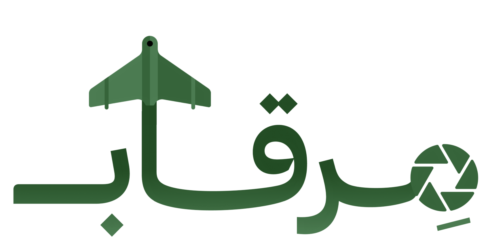

### مِرقاب · Mirqab

**نظام إنذار مبكر متعدد الحساسات للمجال الجوي المنخفض**
**Multi-modal early-warning system for low-altitude airspace**

<br>

[](#award)
[](#vision)
[](#audio)
[](#assistant)


<br>

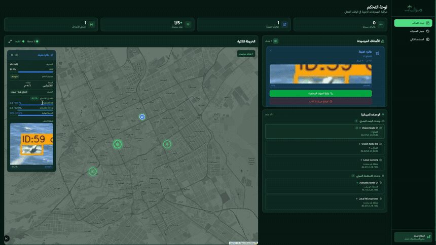

<sub><i>لقطة حقيقية من النظام: كشف بصري + صوتي يُدمَجان ويصلان لوحة القيادة خلال أقل من ثانيتين</i><br>
<i>Real capture: a vision + acoustic pair fusing and reaching the HQ dashboard in under two seconds</i></sub>

<br><br>

**[🇸🇦 اقرأ بالعربية](#arabic) &nbsp;·&nbsp; [🇬🇧 Read in English](#english)**

</div>

---

<div align="center">

| | | | | |
|:--:|:--:|:--:|:--:|:--:|
| **0.8826** | **97.28%** | **0.60 / 0.40** | **54 402** | **187 758** |
| vision mAP@50 | audio accuracy | fusion weights | images curated | audio segments |
| *held-out test* | *held-out test* | *threshold 0.80* | *9 open datasets* | *3 open datasets* |

</div>

---

<a id="arabic"></a>

<div dir="rtl">

# 🇸🇦 بالعربية

## ما هو مِرقاب؟

**مِرقاب** — من *رَقَبَ*، أي راقب وترصّد — منصّة وعي موقفي متكاملة للإنذار المبكر في المجال الجوي المنخفض.

المشكلة التي يعالجها بسيطة في وصفها وصعبة في حلّها: **الكاميرا وحدها تكذب، والميكروفون وحده يكذب.** الطائر يشبه المسيّرة على الشاشة، وصوت المكيّف البعيد يشبه صوت المروحة. أي نظام يعتمد على حسّاس واحد سيغرق غرفة العمليات بإنذارات كاذبة حتى يتوقّف المشغّل عن تصديقه.

مِرقاب يحلّ هذا بأن يجعل **الشهادة المزدوجة شرطًا**: لا يصدر إنذار تهديد إلا حين يتّفق حسّاسان مستقلّان — رؤية حاسوبية وتصنيف صوتي — ضمن نافذة زمنية ومكانية محدّدة، وتتجاوز درجة الدمج الموزونة عتبة صريحة.

النظام كامل من الطرف إلى الطرف: من الوحدة الميدانية التي تلتقط الإطار، مرورًا بالاستدلال والدمج والتخزين، وصولًا إلى لوحة قيادة لحظية ومساعد ذكي محلّي وتصدير بصيغ قيادة وسيطرة معيارية.

<br>

## <a id="award"></a>🏆 المركز الأول — Defensethon

حصل مِرقاب على **المركز الأول في هاكاثون Defensethon**، تقديرًا لمقاربة الدمج متعدّد الحساسات في الزمن الحقيقي، ولاكتمال التنفيذ من استقبال الوحدة الميدانية حتى التصدير المعياري إلى أنظمة القيادة والسيطرة.

<br>

## جولة في النظام

### كشوفات ميدانية حقيقية

مقطعان من تصوير ميداني حقيقي — مسيّرة ثابتة الجناح على منصّة إطلاق، ومقاتلة على ارتفاع عالٍ — مُرِّرا على أوزان `best_model.pt` نفسها التي يشغّلها الخادم في الإنتاج. الصور أدناه هي **مخرَج النموذج كما هو**: صندوق الإحاطة والتصنيف ودرجة الثقة ومعرّف التتبّع من BoTSORT، بلا أي تعديل يدوي.

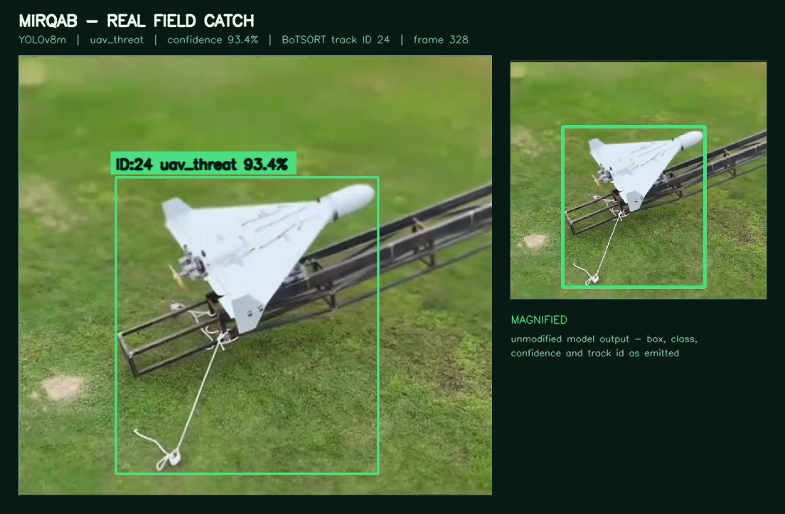

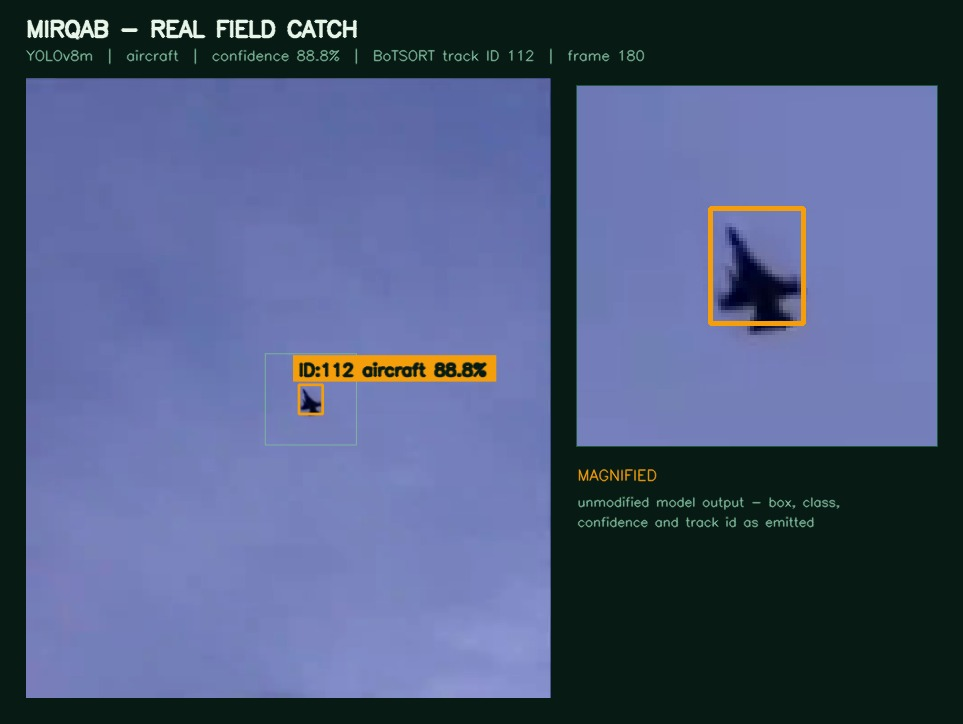

| المقطع | التصنيف | الثقة | معرّف التتبّع |
|---|---|---|---|
| مسيّرة ثابتة الجناح على منصّة إطلاق | `uav_threat` | **٩٣٫٤٪** | 24 |
| مقاتلة على ارتفاع عالٍ | `aircraft` | **٨٨٫٨٪** | 112 |

الحالة الثانية هي الأصعب فعليًا: الهدف يشغل أقل من **٠٫٣٪** من مساحة الإطار، وبتباين ضعيف أمام غيوم رمادية — وهي بالضبط الحالة التي يفشل فيها الكشف أحادي الحسّاس، ومن أجلها بُني شرط الشهادة المزدوجة.

### لوحة التحكم

الشاشة الأساسية للمشغّل: خريطة تفاعلية بمواقع الحسّاسات والأهداف، بطاقات مؤشّرات حيّة، قائمة أهداف مرصودة، وحالة كل وحدة ميدانية. كل هدف مربوط بخطّ متقطّع إلى الحسّاس الذي رصده.

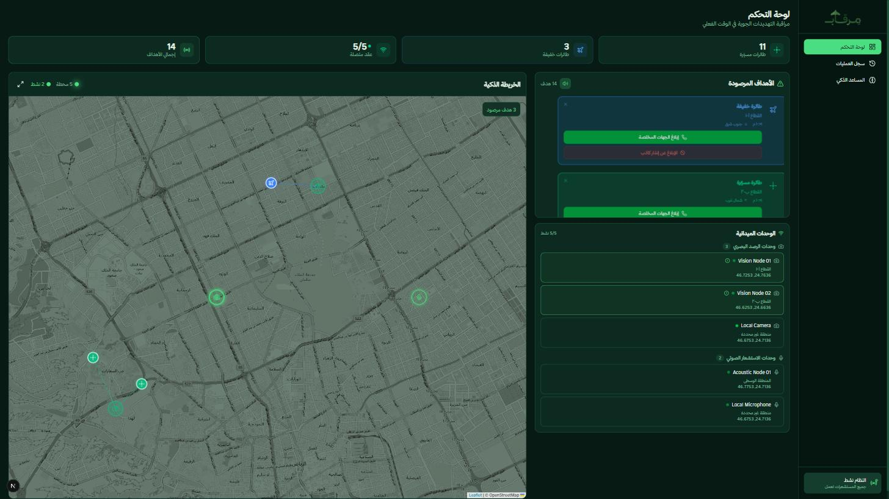

<details>
<summary><b>لوحة تفاصيل الهدف</b> — بالضغط على أي علامة على الخريطة</summary>
<br>
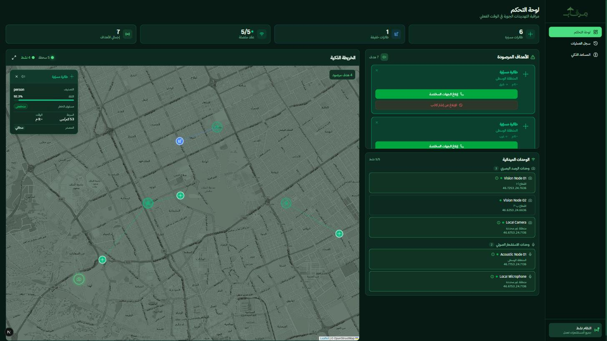
</details>

### سجل العمليات

سجلّ كامل بكل حدث كشف، مع فلاتر على نوع الوحدة والخطورة والفترة الزمنية. صفوف الأحداث المدمجة تعرض ثقة الرؤية وثقة الصوت والدرجة المدمجة، إضافة إلى لقطة الكشف الحقيقية من نموذج YOLO.

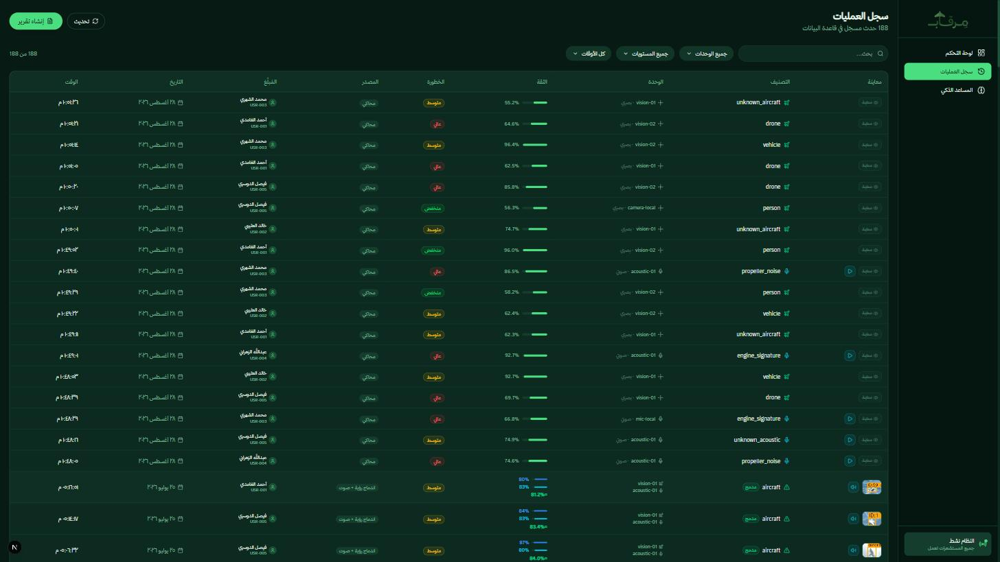

<details>
<summary><b>الأحداث المدمجة عن قرب</b> — شريطا ثقة + درجة الدمج + لقطة YOLO</summary>
<br>
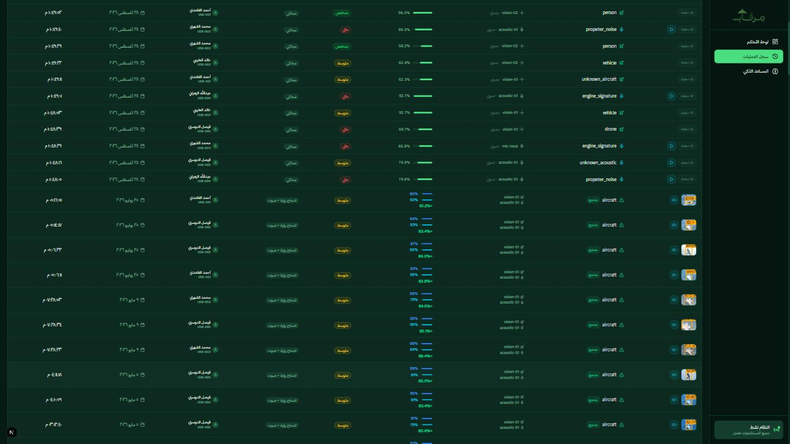
</details>

<details>
<summary><b>معاينة الحدث</b> — لقطة الكشف، المسار المتوقّع، وتفكيك الثقة</summary>
<br>
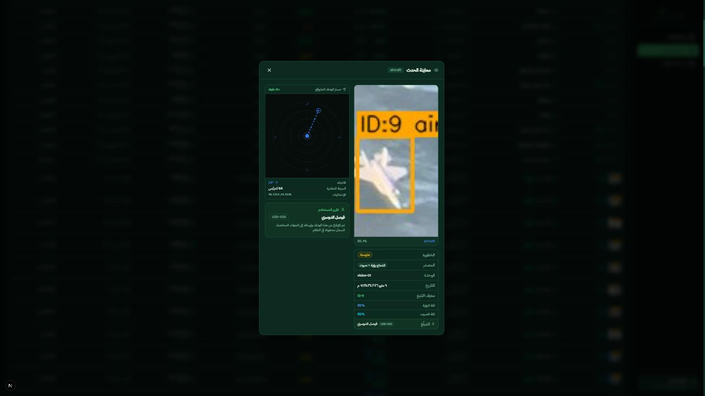
<br>
<sub>حدث حقيقي من قاعدة البيانات: ثقة رؤية ٨٥٪ + ثقة صوت ٨٥٪ ← درجة دمج ٨٥٫١٪، مع صندوق الإحاطة الذي أنتجه النموذج ومعرّف التتبّع <code>ID:9</code>.</sub>
</details>

### وحدة القيادة والسيطرة

كل حدث مدمج يُنشئ أو يُحدّث **مسارًا تكتيكيًا**. الشاشة تعرض المسارات النشطة بحالتها الحركية وثقتها ومستوى تهديدها، مع تصدير مباشر إلى `CoT XML` و`ASTERIX CAT062`، وزر تسليم إلى الرادار.

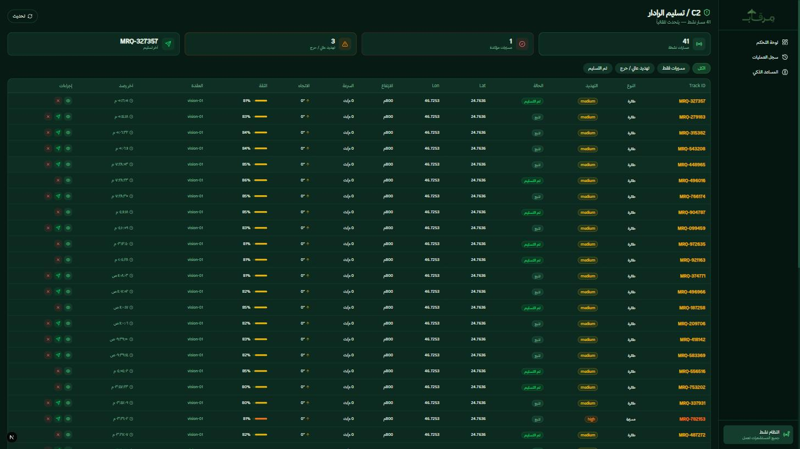

<details>
<summary><b>تصدير المسار</b> — Track JSON و CoT XML</summary>
<br>
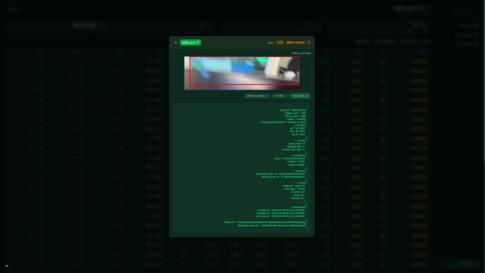
<br><br>
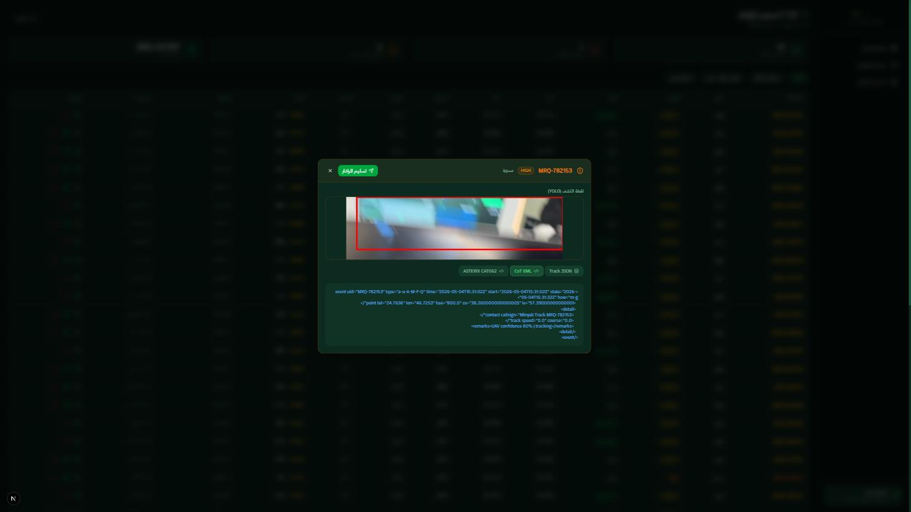
</details>

### المساعد الذكي

مساعد تشغيلي يعمل **محليًا بالكامل** عبر Ollama. يجيب عن أسئلة المشغّل حول الصورة الجوية وإحصاءات التهديد وصحّة العقد وإجراءات التشغيل — **ويرفض صراحةً** أي سؤال تكتيكي أو قتالي.

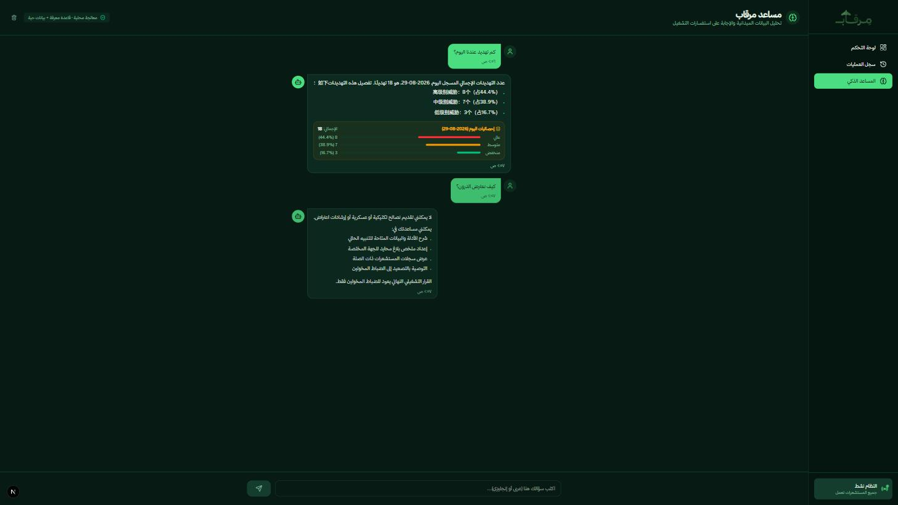

<sub>في اللقطة أعلاه: سؤال إحصائي أُجيب من قاعدة البيانات مباشرة مع رسم بياني، ثم سؤال اعتراض مسيّرة قوبل برفض فوري لم يصل النموذج اللغوي أصلًا.</sub>

<details>
<summary><b>إجابة من قاعدة المعرفة</b> — مع ذكر المصادر</summary>
<br>
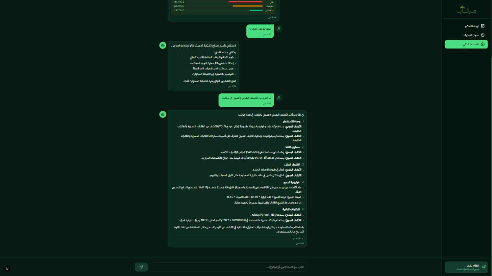
</details>

<br>

## معمارية النظام

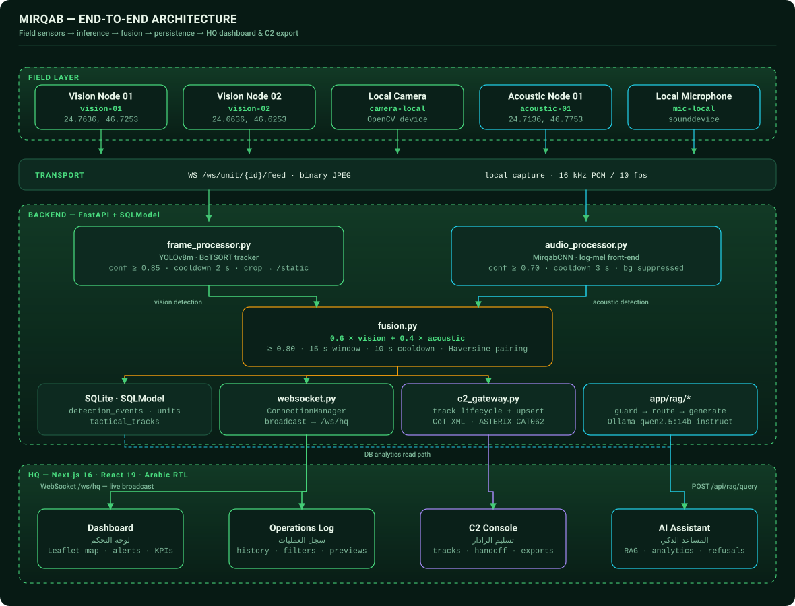

المسار كاملًا في جملة واحدة: الوحدة الميدانية تدفع إطارًا أو صوتًا ← نموذج الاستدلال المناسب يُخرج كشفًا ← محرّك الدمج يبحث عن شاهد ثانٍ ← عند النجاح يُخزَّن الحدث ويُبَثّ إلى كل عملاء المقر ويُنشئ مسارًا تكتيكيًا.

<br>

## <a id="fusion"></a>محرّك الدمج

هذا هو قلب النظام، وهو الجزء الذي يفصل مِرقاب عن «كاشف أجسام على خريطة».

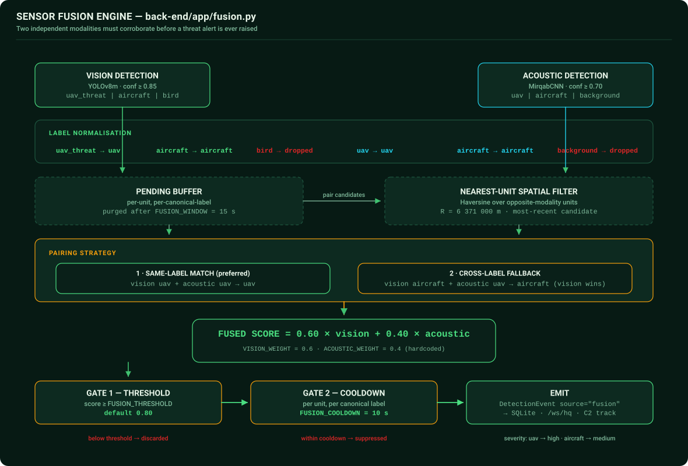

### المعادلة

<div dir="ltr">

```
درجة الدمج  =  0.60 × ثقة الرؤية  +  0.40 × ثقة الصوت
```

</div>

الوزن الأعلى للرؤية لأنها تعطي تصنيفًا وموقعًا وصندوق إحاطة، بينما الصوت يعطي تأكيدًا قويًا لكنه أفقر في التوطين.

### الثوابت الفعلية

| الثابت | القيمة الافتراضية | الوظيفة |
|---|---|---|
| `VISION_WEIGHT` | `0.6` | وزن الرؤية (مثبّت في الشيفرة) |
| `ACOUSTIC_WEIGHT` | `0.4` | وزن الصوت (مثبّت في الشيفرة) |
| `FUSION_THRESHOLD` | `0.80` | أدنى درجة دمج لإصدار إنذار |
| `FUSION_WINDOW` | `15.0` ث | نافذة الاقتران الزمنية بين الحسّاسين |
| `FUSION_COOLDOWN` | `10.0` ث | فترة تهدئة لكل وحدة ولكل تصنيف |

### تطبيع التصنيفات

| المصدر | التصنيف الخام | بعد التطبيع |
|---|---|---|
| رؤية | `uav_threat` | `uav` |
| رؤية | `aircraft` | `aircraft` |
| رؤية | `bird` | **يُسقَط** |
| صوت | `uav` | `uav` |
| صوت | `aircraft` | `aircraft` |
| صوت | `background` | **يُسقَط** |

### استراتيجية الاقتران

1. **مطابقة بنفس التصنيف** (المفضّلة) — رؤية `uav` + صوت `uav` ← `uav`.
2. **الاحتياط بتصنيف مختلف** — رؤية `aircraft` + صوت `uav` ← `aircraft`؛ **تصنيف الرؤية يفوز دائمًا**، ويُوسَم الحدث بـ `cross_label_fusion: true`.
3. **الترشيح المكاني** — عند تعدّد الوحدات، يُختار أقرب حسّاس من النوع المقابل بمسافة هافرسين (نصف قطر الأرض ٦ ٣٧١ ٠٠٠ م)، ثم أحدث مرشّح لديه.

الكشوفات التي لا تجد شاهدًا ثانيًا خلال ١٥ ثانية تُمسح من المخزن المؤقّت بصمت — لا إنذار ولا سجلّ تهديد.

### مستوى الخطورة

| التصنيف المدمج | الخطورة |
|---|---|
| `uav` | **عالٍ** |
| `aircraft` | **متوسط** |

<br>

## <a id="vision"></a>نموذج الرؤية — YOLOv8m

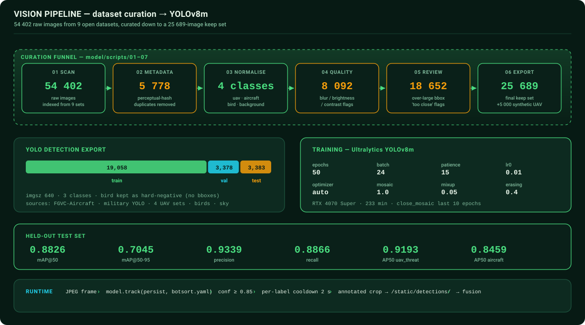

### تجهيز البيانات

جُمعت **٥٤ ٤٠٢ صورة** من تسع مجموعات بيانات مفتوحة (طائرات مدنية، طائرات عسكرية، أربع مجموعات مسيّرات، طيور، وخلفيات سماء)، ثم مرّت بخط تنقية من سبع مراحل: فهرسة، استخراج بيانات وصفية وبصمة إدراكية (perceptual hash) لكشف التكرار، توحيد التسميات، فحوص جودة (ضبابية، سطوع، تباين، دقّة دنيا)، مراجعة مرتّبة بالأولوية، ثم تصدير.

| المرحلة | العدد |
|---|---|
| صور مفحوصة | ٥٤ ٤٠٢ |
| مكرّرات أُزيلت | ٥ ٧٧٨ |
| صور موسومة كمنخفضة الجودة | ٨ ٠٩٢ |
| صور موسومة «قريبة جدًا» (صندوق إحاطة ضخم) | ١٨ ٦٥٢ |
| صور مسيّرات اصطناعية أُضيفت | ٥ ٠٠٠ |
| **المجموعة النهائية المعتمدة** | **٢٥ ٦٨٩** |

تصدير الكشف بصيغة YOLO: **١٩ ٠٥٨** تدريب / **٣ ٣٧٨** تحقّق / **٣ ٣٨٣** اختبار.

> صنف `bird` مُدرَّب بلا صناديق إحاطة عمدًا — يُستخدم كـ**سالب صعب** ليتعلّم النموذج ألّا يبلّغ عن الطيور، ولذلك لا يوجد له مقياس AP.

### التدريب

`YOLOv8m` من Ultralytics، ٥٠ حقبة، دفعة ٢٤، مقاس صورة ٦٤٠، مُحسِّن تلقائي، `lr0=0.01`، صبر ١٥. تعزيز: `mosaic=1.0`, `mixup=0.05`, دوران ١٠°, إزاحة ٠٫١, تحجيم ٠٫٥, قلب أفقي ٠٫٥, مسح عشوائي ٠٫٤, `randaugment` — مع تعطيل الـ mosaic في آخر ١٠ حقب. جرى التدريب على `RTX 4070 Super` في **٢٣٣ دقيقة**.

### النتائج على مجموعة الاختبار المعزولة

| المقياس | القيمة |
|---|---|
| **mAP@50** | **0.8826** |
| **mAP@50-95** | **0.7045** |
| الدقّة (Precision) | 0.9339 |
| الاستدعاء (Recall) | 0.8866 |
| AP@50 — `uav_threat` | 0.9193 |
| AP@50 — `aircraft` | 0.8459 |

<details>
<summary><b>منحنيات التدريب ومصفوفة الالتباس (مخرجات Ultralytics الأصلية)</b></summary>
<br>
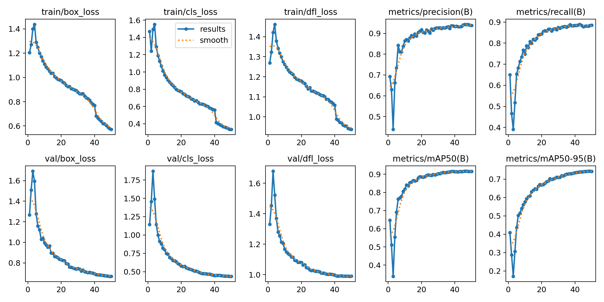
<br><br>
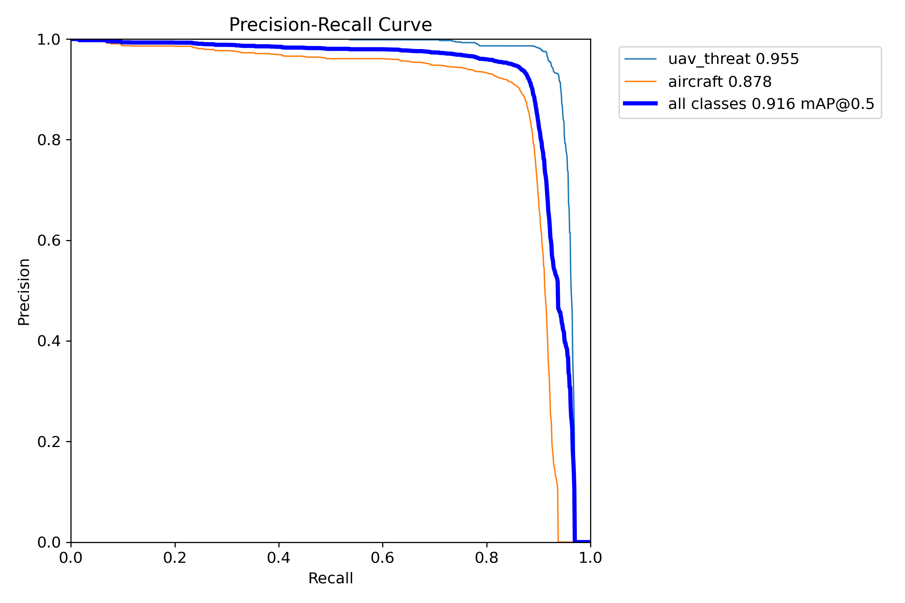
</details>

<details>
<summary><b>عيّنة تنبّؤات على مجموعة الاختبار</b></summary>
<br>
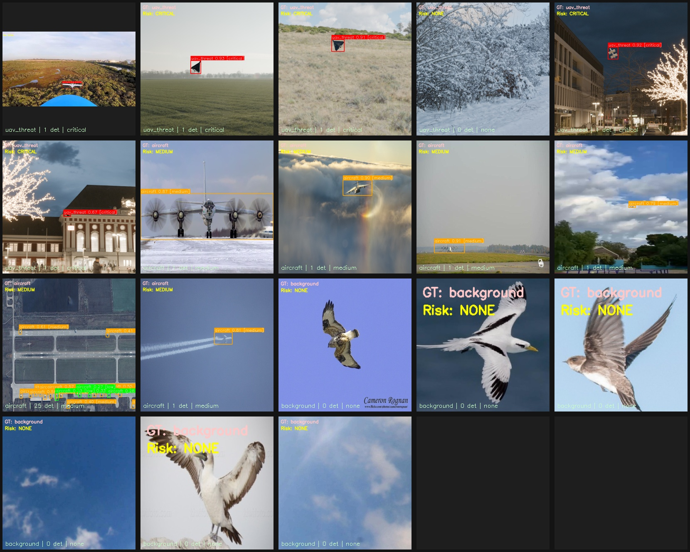
</details>

### أثناء التشغيل

إطار JPEG ← `model.track(persist=True, tracker="botsort.yaml")` ← ترشيح عند ثقة ≥ `0.85` ← تهدئة ثانيتين لكل تصنيف ← حفظ قصاصة مُعلَّمة في `/static/detections/{uuid}.jpg` ← إرسال إلى محرّك الدمج.

> التتبّع يستخدم **BoTSORT** لأنه يعتمد على SciPy فقط ولا يتطلّب `lap`. في حال فشل التتبّع لأي سبب، يسقط النظام تلقائيًا إلى استدلال بلا تتبّع بدل أن يتوقّف.

<br>

## <a id="audio"></a>النموذج الصوتي — MirqabCNN

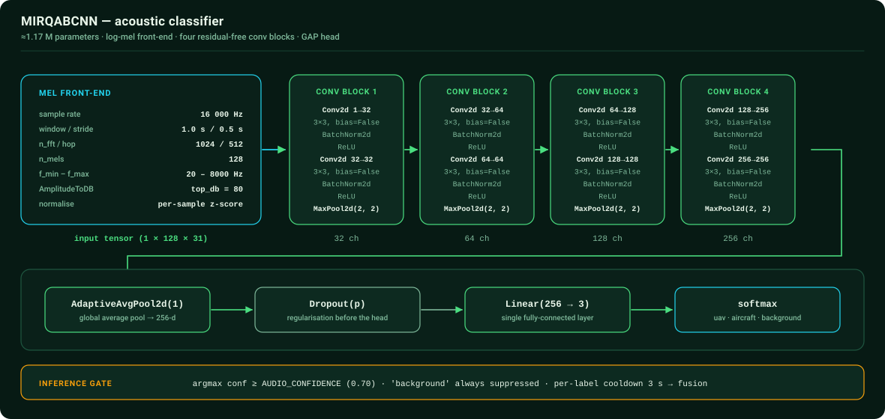

شبكة التفافية مصمّمة خصيصًا لهذا النظام، بحوالي **١٫١٧ مليون معامل** فقط — صغيرة بما يكفي للعمل على وحدة ميدانية متواضعة.

<details>
<summary><b>البنية بلغة PyTorch</b></summary>

<div dir="ltr">

```python
class ConvBlock(nn.Module):          # Conv3×3 → BN → ReLU  ×2  → MaxPool2
    ...

class MirqabCNN(nn.Module):
    encoder = nn.Sequential(
        ConvBlock(1,   32),
        ConvBlock(32,  64),
        ConvBlock(64,  128),
        ConvBlock(128, 256),
    )
    gap  = nn.AdaptiveAvgPool2d(1)
    head = nn.Sequential(nn.Dropout(p), nn.Linear(256, 3))
```

</div>

كل `ConvBlock` يحتوي **طبقتَي التفاف ٣×٣** بلا انحياز، كلٌّ منهما متبوعة بتطبيع دفعي و`ReLU`، ثم تجميع أقصى بمعامل ٢.
</details>

### الواجهة الأمامية للإشارة

| الخاصية | القيمة |
|---|---|
| تردّد العيّنة | ١٦ ٠٠٠ هرتز (إعادة عيّنة تلقائية) |
| النافذة / الخطوة | ١٫٠ ث / ٠٫٥ ث (تداخل ٥٠٪) |
| `n_fft` / `hop_length` | ١٠٢٤ / ٥١٢ |
| عدد نطاقات Mel | ١٢٨ |
| المدى الترددي | ٢٠ – ٨٠٠٠ هرتز |
| `AmplitudeToDB` | `top_db = 80` |
| التطبيع | درجة معيارية لكل عيّنة (z-score) |
| التصنيفات | `uav` · `aircraft` · `background` |
| عتبة الثقة | `0.70` |
| فترة التهدئة | ٣ ثوانٍ لكل تصنيف |

### بيانات التدريب

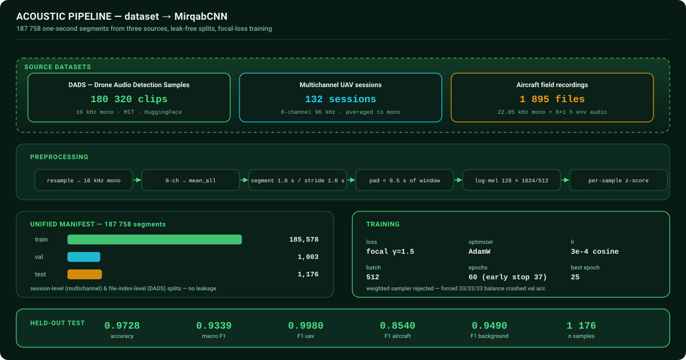

ثلاث مجموعات مفتوحة: **DADS** (١٨٠ ٣٢٠ مقطعًا، رخصة MIT)، **١٣٢ جلسة** ثمانية القنوات بتردّد ٩٦ كيلوهرتز، و**١ ٨٩٥ ملفًا** لتسجيلات طائرات ميدانية. بعد التقطيع والتوحيد: **١٨٧ ٧٥٨ مقطعًا** بطول ثانية واحدة.

التقسيم يمنع التسرّب بشكل صريح — على مستوى **الجلسة** للتسجيلات متعدّدة القنوات، وعلى مستوى **ملف المصدر** لمجموعة DADS: **١٨٥ ٥٧٨** تدريب / **١ ٠٠٣** تحقّق / **١ ١٧٦** اختبار.

> الفئات غير متوازنة بشدّة (٤٦٧ مقطع طائرة مقابل ١٦٧ ١٩١ مقطع مسيّرة في التدريب). جُرِّب `WeightedRandomSampler` أولًا فأجبر توازنًا ٣٣/٣٣/٣٣ **وانهارت** دقّة التحقّق. الحلّ المعتمد: **دالة خسارة بؤرية** (`focal loss`, γ = 1.5) مع أوزان فئات محسوبة.

### النتائج على مجموعة الاختبار المعزولة

| المقياس | القيمة |
|---|---|
| **الدقّة الكلّية** | **0.9728** |
| **Macro F1** | **0.9339** |
| F1 — `uav` | 0.9980 |
| F1 — `aircraft` | 0.8540 |
| F1 — `background` | 0.9490 |

<div align="center">
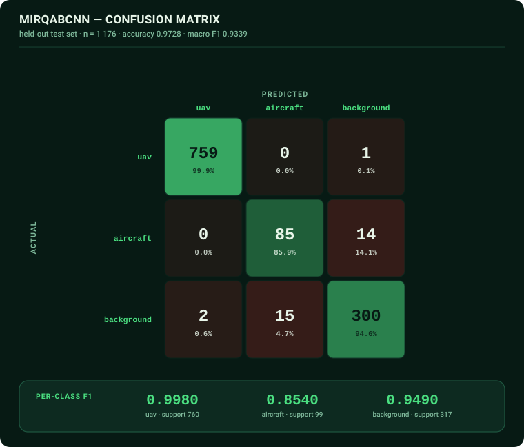
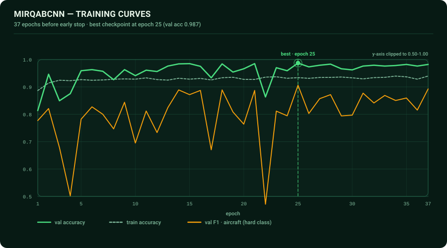
</div>

الالتباس المتبقّي يتركّز كلّه بين `aircraft` و`background` — وهو منطقي: تسجيل طائرة بعيدة يقترب من الضجيج البيئي. أمّا `uav` فيكاد يكون مثاليًا (٧٥٩ من ٧٦٠).

<br>

## <a id="assistant"></a>المساعد التشغيلي

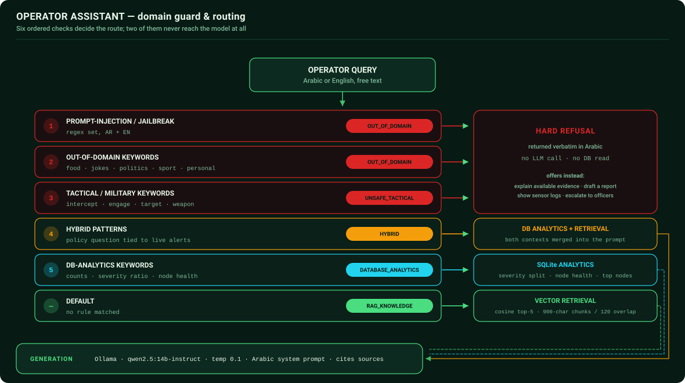

يعمل كليًا على جهاز محلّي عبر **Ollama** — لا استدعاءات سحابية ولا خروج بيانات:

| المكوّن | النموذج |
|---|---|
| التوليد | `qwen2.5:14b-instruct` |
| التضمين | `dengcao/Qwen3-Embedding-0.6B:Q8_0` |

### حارس النطاق

قبل أي شيء آخر، يمرّ السؤال على ستة فحوص مرتّبة. **الفحوص الثلاثة الأولى ترفض فورًا ولا تصل النموذج اللغوي ولا قاعدة البيانات إطلاقًا:**

| # | الفحص | المسار |
|---|---|---|
| ١ | أنماط حقن التعليمات وكسر القيود | `OUT_OF_DOMAIN` — رفض |
| ٢ | كلمات خارج النطاق (طعام، نكات، سياسة، رياضة، شخصي) | `OUT_OF_DOMAIN` — رفض |
| ٣ | كلمات تكتيكية/عسكرية (اعتراض، اشتباك، استهداف، سلاح) | `UNSAFE_TACTICAL` — رفض |
| ٤ | أنماط هجينة (سؤال سياسة مرتبط بإنذارات حيّة) | `HYBRID` |
| ٥ | كلمات تحليلات قاعدة البيانات (أعداد، نسب خطورة، صحّة العقد) | `DATABASE_ANALYTICS` |
| — | لا تطابق | `RAG_KNOWLEDGE` |

### النطاق المسموح

ملخّصات الإنذارات، إحصاءات التهديد، حالة العقد الميدانية، تحليلات اللوحة، تقارير الحوادث، واستكشاف الأعطال.

### المرفوض صراحةً

المشورة التكتيكية، توجيه الاعتراض أو الاستهداف، توصيات الاشتباك أو الرمي، استخدام الأسلحة، وقرارات القيادة الميدانية. النظام يذكّر دائمًا أن **القرار التشغيلي النهائي يعود للضباط المخوّلين فقط**.

### قاعدة المعرفة

سبع وثائق تشغيلية في `back-end/rag-documents/` تُقسَّم إلى مقاطع بطول ٩٠٠ محرف وتداخل ١٢٠، وتُبحث بتشابه جيب التمام مع استرجاع أفضل ٥ مقاطع. درجة الحرارة `0.1` لتقليل الاختلاق، والإجابة تأتي بلغة السؤال نفسها مع ذكر المصادر.

<br>

## <a id="c2"></a>التكامل مع القيادة والسيطرة

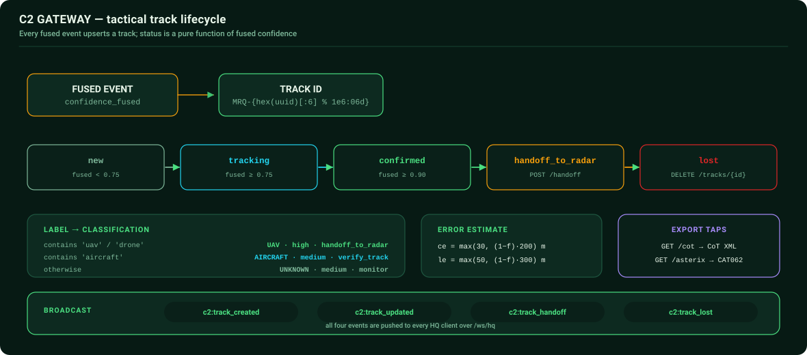

كل حدث مدمج يُنشئ أو يُحدّث مسارًا تكتيكيًا بمعرّف مشتقّ من معرّف الحدث بصيغة `MRQ-XXXXXX`. حالة المسار دالّة مباشرة في درجة الدمج:

| درجة الدمج | الحالة |
|---|---|
| `< 0.75` | `new` |
| `≥ 0.75` | `tracking` |
| `≥ 0.90` | `confirmed` |

ويُضاف إليها `handoff_to_radar` عند التسليم اليدوي، و`lost` عند الحذف.

### Cursor-on-Target (CoT)

مخرَج حقيقي من `GET /api/c2/tracks/MRQ-782153/cot` — متوافق مع أدوات TAK:

<div dir="ltr">

```xml
<event uid="MRQ-782153" type="a-u-A-M-F-Q" time="2026-05-04T15:31:02Z" start="2026-05-04T15:31:02Z" stale="2026-05-04T15:31:32Z" how="m-g">
  <point lat="24.7636" lon="46.7253" hae="800.0" ce="38.26" le="57.39"/>
  <detail>
    <contact callsign="Mirqab Track MRQ-782153"/>
    <track speed="0.0" course="0.0"/>
    <remarks>UAV confidence 80% | tracking</remarks>
  </detail>
</event>
```

</div>

نوع الحدث `a-u-A-M-F-Q` للمسيّرات و`a-u-A-M-F` لغيرها. نافذة التقادم `stale` ثابتة عند ٣٠ ثانية.

### ASTERIX CAT062

مخرَج حقيقي من `GET /api/c2/tracks/MRQ-782153/asterix`:

<div dir="ltr">

```json
{
  "category": "CAT062",
  "source": "Mirqab C2 Gateway",
  "trackNumber": "MRQ-782153",
  "trackStatus": "tracking",
  "targetIdentification": "UAV",
  "positionWGS84": { "lat": 24.7636, "lon": 46.7253 },
  "geometricAltitudeM": 800.0,
  "groundSpeedMps": 0.0,
  "trackAngleDeg": 0.0,
  "verticalRateMps": 0.0,
  "systemTrackUpdateTime": "2026-05-04T15:31:02.952885",
  "accuracy": { "horizontalErrorM": 38.26, "verticalErrorM": 57.39 },
  "confidence": 0.8087,
  "threatLevel": "high",
  "recommendedAction": "handoff_to_radar",
  "sensorIds": ["vision-01", "acoustic-01"]
}
```

</div>

تقديرات الخطأ مشتقّة من الثقة: `ce = max(30, (1−f)·200)` م أفقيًا و`le = max(50, (1−f)·300)` م رأسيًا.

<br>

## التشغيل

### المتطلّبات

Python 3.12+ · Node.js 20+ · [Ollama](https://ollama.com) للمساعد الذكي · بطاقة رسومية تدعم CUDA (اختيارية، البديل المعالج المركزي) · Docker (اختياري).

> **أوزان النماذج غير مضمّنة في المستودع** (مستثناة في `.gitignore`). ضعها في:
> `model/model_workspace/models/best_model.pt` و `model/audio_workspace/models/best_model.pth`،
> أو وجّه `MODEL_PATH` و`AUDIO_MODEL_PATH` إلى مساريهما.

### الخادم الخلفي

<div dir="ltr">

```bash
cd back-end
python -m venv .venv
.venv\Scripts\Activate.ps1        # ويندوز
source .venv/bin/activate         # لينكس / ماك

pip install -r requirements.txt
cp .env.example .env

uvicorn app.main:app --reload --host 0.0.0.0 --port 8000
```

</div>

الخادم على `http://localhost:8000` · توثيق تفاعلي على `/docs` و`/redoc`.

### الواجهة

<div dir="ltr">

```bash
cd front-end
npm install
cp .env.local.example .env.local
npm run dev
```

</div>

اللوحة على `http://localhost:3000`.

### المساعد الذكي

<div dir="ltr">

```bash
ollama pull qwen2.5:14b-instruct
ollama pull dengcao/Qwen3-Embedding-0.6B:Q8_0

# فهرسة قاعدة المعرفة (خطوة يدوية مطلوبة مرّة واحدة)
curl -X POST http://localhost:8000/api/rag/ingest
# أو:  python back-end/ingest_docs.py
```

</div>

الوثائق تُقرأ من `back-end/rag-documents/` وتدعم `.md` و`.txt` و`.json` و`.csv`.

### Docker

<div dir="ltr">

```bash
docker compose up --build          # أو -d للتشغيل في الخلفية
docker compose down
```

</div>

> عند التشغيل داخل Docker على ويندوز أو ماك، اضبط `OLLAMA_BASE_URL=http://host.docker.internal:11434`.

### تشغيل سريع على ويندوز

<div dir="ltr">

```bat
run.bat
```

</div>

يفتح نافذتَي طرفية: واحدة للخادم الخلفي وأخرى للواجهة.

### عرض بلا عتاد

<div dir="ltr">

```bash
curl -X POST http://localhost:8000/api/simulator/start
curl -X POST http://localhost:8000/api/simulator/stop
```

</div>

المحاكي يولّد أحداثًا كل ٥–١٥ ثانية لكل الوحدات المسجّلة، وهو ما استُخدم في لقطات لوحة التحكم أعلاه. كما توفّر صفحات `/unit-demo` و`/audio-demo` و`/video-demo` مسارات حقن يدوية للعروض.

<br>

## المرجع التقني

<details>
<summary><b>واجهات REST كاملة</b></summary>

| الطريقة | المسار | الوصف |
|---|---|---|
| `GET` | `/` | معلومات الخدمة |
| `GET` | `/health` | فحص الحالة |
| `GET` | `/api/debug/db` | إحصاءات قاعدة البيانات |
| `GET` | `/api/units` | قائمة الوحدات وحالتها |
| `POST` | `/api/units` | إنشاء أو تحديث وحدة |
| `GET` | `/api/events?limit=100` | أحدث أحداث الكشف (حد أقصى ٥٠٠) |
| `POST` | `/api/detections` | استقبال حدث كشف مباشر |
| `GET` | `/api/c2/tracks` | كل المسارات النشطة |
| `GET` | `/api/c2/tracks/{id}` | مسار واحد |
| `POST` | `/api/c2/tracks` | إنشاء أو تحديث مسار |
| `POST` | `/api/c2/tracks/{id}/handoff` | تسليم إلى الرادار |
| `DELETE` | `/api/c2/tracks/{id}` | وسم المسار كمفقود |
| `GET` | `/api/c2/tracks/{id}/cot` | تصدير CoT XML |
| `GET` | `/api/c2/tracks/{id}/asterix` | تصدير ASTERIX CAT062 |
| `POST` | `/api/simulator/start` · `/stop` | تشغيل وإيقاف المحاكي |
| `GET` | `/api/simulator/status` | حالة المحاكي |
| `POST` | `/api/camera/start` · `/stop` | التقاط الكاميرا المحلّية |
| `GET` | `/api/camera/status` | حالة الكاميرا |
| `POST` | `/api/audio/start` · `/stop` | التقاط الميكروفون المحلّي |
| `GET` | `/api/audio/status` | حالة الصوت |
| `POST` | `/api/unit-demo/detection` | حقن كشف بصري تجريبي |
| `POST` | `/api/audio-demo/detection` | حقن كشف صوتي تجريبي |
| `POST` | `/api/video-demo/upload` | رفع فيديو للاستدلال البصري والصوتي معًا |
| `POST` | `/api/rag/query` | سؤال المساعد |
| `POST` | `/api/rag/ingest` | فهرسة قاعدة المعرفة |
| `GET` | `/api/rag/status` | إحصاءات مخزن المتّجهات |
| `GET` | `/api/analytics/threats/today` | تهديدات اليوم حسب الخطورة |
| `GET` | `/api/analytics/alerts/severity` | توزيع الخطورة |
| `GET` | `/api/analytics/nodes/health` | صحّة العقد |
| `GET` | `/api/analytics/incidents/summary` | ملخّص الحوادث اليومي |

</details>

<details>
<summary><b>قنوات WebSocket</b></summary>

| المسار | الاتجاه | المحتوى |
|---|---|---|
| `/ws/hq` | خادم ← عميل | بثّ الأحداث وحالة الوحدات ومسارات C2 |
| `/ws/unit/{unit_id}/feed` | وحدة ← خادم | إطارات JPEG ثنائية للاستدلال |
| `/ws/unit/{unit_id}/view` | خادم ← مشاهد | إطارات JPEG مُعلَّمة للعرض الحيّ |

**حمولة حقيقية لحدث مدمج على `/ws/hq`:**

<div dir="ltr">

```json
{
  "id": "9d953d67-d23d-4b6e-97f8-d5a4d3775cbb",
  "unit_id": "vision-01",
  "unit_type": "fusion",
  "event_type": "detection",
  "label": "aircraft",
  "confidence": 0.8115,
  "severity": "medium",
  "lat": 24.7636,
  "lng": 46.7253,
  "timestamp": "2026-07-25T17:16:51.697223",
  "source": "fusion",
  "frame_url": "/static/detections/0596836f-56ab-4912-8b7a-9bf72ef427b8.jpg",
  "metadata": {
    "vision_unit": "vision-01",
    "acoustic_unit": "acoustic-01",
    "vision_confidence": 0.8005154132843018,
    "acoustic_confidence": 0.828,
    "vision_label": "aircraft",
    "acoustic_label": "uav",
    "fusion_score": 0.8115,
    "vision_weight": 0.6,
    "acoustic_weight": 0.4,
    "cross_label_fusion": true,
    "track_id": 59
  }
}
```

</div>

أحداث حالة الوحدات تستخدم `event_type: "unit_status"`، وأحداث القيادة والسيطرة تستخدم `c2:track_created` و`c2:track_updated` و`c2:track_handoff` و`c2:track_lost`.

</details>

<details>
<summary><b>متغيّرات البيئة</b></summary>

**الخادم الخلفي — `back-end/.env`**

| المتغيّر | الافتراضي | الوصف |
|---|---|---|
| `DATABASE_URL` | `sqlite:///./marqab.db` | سلسلة اتصال SQLAlchemy |
| `CORS_ORIGINS` | `http://localhost:3000,...` | أصول مسموح بها، مفصولة بفواصل |
| `SIMULATOR_AUTOSTART` | `false` | تشغيل المحاكي عند الإقلاع |
| `CAMERA_AUTOSTART` | `false` | تشغيل الكاميرا المحلّية عند الإقلاع |
| `CAMERA_INDEX` | `0` | رقم جهاز الكاميرا في OpenCV |
| `CAMERA_FPS` | `10` | معدّل الالتقاط المستهدف |
| `AUDIO_AUTOSTART` | `false` | تشغيل الميكروفون عند الإقلاع |
| `AUDIO_DEVICE` | *(فارغ)* | جهاز الإدخال؛ الفارغ يعني الافتراضي |
| `MODEL_PATH` | `model/model_workspace/models/best_model.pt` | أوزان YOLOv8m |
| `DETECTION_CONFIDENCE` | `0.85` | عتبة ثقة الرؤية |
| `DETECTION_COOLDOWN` | `2.0` | تهدئة الرؤية بالثواني |
| `AUDIO_MODEL_PATH` | `model/audio_workspace/models/best_model.pth` | أوزان MirqabCNN |
| `AUDIO_CONFIDENCE` | `0.70` | عتبة ثقة الصوت |
| `AUDIO_COOLDOWN` | `3.0` | تهدئة الصوت بالثواني |
| `FUSION_THRESHOLD` | `0.80` | عتبة الدمج |
| `FUSION_WINDOW` | `15.0` | نافذة الاقتران بالثواني |
| `FUSION_COOLDOWN` | `10.0` | تهدئة الدمج بالثواني |
| `OLLAMA_BASE_URL` | `http://localhost:11434` | نقطة نهاية Ollama |
| `RAG_LLM_MODEL` | `qwen2.5:14b-instruct` | نموذج التوليد |
| `RAG_EMBEDDING_MODEL` | `dengcao/Qwen3-Embedding-0.6B:Q8_0` | نموذج التضمين |
| `RAG_TOP_K` | `5` | عدد المقاطع المسترجَعة |
| `RAG_TEMPERATURE` | `0.1` | درجة حرارة التوليد |
| `RAG_MAX_CONTEXT_CHARS` | `12000` | حدّ سياق التوليد بالمحارف |

**الواجهة — `front-end/.env.local`**

| المتغيّر | الافتراضي |
|---|---|
| `NEXT_PUBLIC_BACKEND_URL` | `http://localhost:8000` |
| `NEXT_PUBLIC_WS_URL` | `ws://localhost:8000/ws/hq` |

</details>

<details>
<summary><b>مخطّط قاعدة البيانات</b></summary>

<div dir="ltr">

```sql
-- العقد الميدانية
CREATE TABLE units (
    unit_id        TEXT PRIMARY KEY,
    unit_type      TEXT,        -- "vision" | "acoustic"
    name           TEXT,
    status         TEXT,        -- "online" | "offline"   (تُصفَّر عند كل إقلاع)
    lat            FLOAT,
    lng            FLOAT,
    last_seen      TIMESTAMP,
    metadata_json  TEXT
);

-- أحداث الكشف الخام والمدمجة
CREATE TABLE detection_events (
    id             TEXT PRIMARY KEY,
    unit_id        TEXT,
    unit_type      TEXT,        -- "vision" | "acoustic" | "fusion"
    event_type     TEXT,        -- "detection"
    label          TEXT,
    confidence     FLOAT,
    severity       TEXT,        -- "low" | "medium" | "high"
    lat            FLOAT,
    lng            FLOAT,
    timestamp      TIMESTAMP,
    source         TEXT,        -- "model" | "fusion" | "simulator"
    frame_id       TEXT,
    frame_url      TEXT,        -- /static/detections/{uuid}.jpg
    bbox_json      TEXT,
    metadata_json  TEXT
);

-- المسارات التكتيكية
CREATE TABLE tactical_tracks (
    track_id             TEXT PRIMARY KEY,   -- MRQ-XXXXXX
    object_type          TEXT,   -- "UAV" | "AIRCRAFT" | "UNKNOWN"
    threat_level         TEXT,   -- "low" | "medium" | "high" | "critical"
    status               TEXT,   -- new | tracking | confirmed | handoff_to_radar | lost
    recommended_action   TEXT,
    lat                  FLOAT,
    lon                  FLOAT,
    alt_m                FLOAT,
    speed_mps            FLOAT,
    heading_deg          FLOAT,
    vertical_rate_mps    FLOAT,
    confidence_vision    FLOAT,
    confidence_acoustic  FLOAT,
    confidence_fused     FLOAT,
    horizontal_error_m   FLOAT,
    vertical_error_m     FLOAT,
    node_id              TEXT,
    source_unit_type     TEXT,
    sensor_ids_json      TEXT,
    created_at           TIMESTAMP,
    updated_at           TIMESTAMP,
    last_seen_at         TIMESTAMP,
    detection_event_id   TEXT,
    frame_url            TEXT
);
```

</div>

**الوحدات المزروعة عند أوّل إقلاع**

| المعرّف | النوع | الاسم | الإحداثيات |
|---|---|---|---|
| `vision-01` | رؤية | Vision Node 01 | 24.7636, 46.7253 |
| `vision-02` | رؤية | Vision Node 02 | 24.6636, 46.6253 |
| `acoustic-01` | صوت | Acoustic Node 01 | 24.7136, 46.7753 |
| `camera-local` | رؤية | Local Camera | 24.7136, 46.6753 |
| `mic-local` | صوت | Local Microphone | 24.7136, 46.6753 |

</details>

<details>
<summary><b>حزمة التقنيات</b></summary>

**الخادم الخلفي** — FastAPI · Uvicorn · SQLModel (SQLAlchemy + Pydantic) · SQLite · Ultralytics YOLOv8 · OpenCV headless · PyTorch 2.5 + torchaudio · sounddevice · SciPy · httpx · Ollama

**الواجهة** — Next.js 16.2.4 (App Router, Turbopack) · React 19 · TypeScript 5.7 · Tailwind CSS 4 · Radix UI · Leaflet 1.9 · Zustand 5 · Framer Motion 12 · lucide-react · Sonner

**البنية التحتية** — Docker + Docker Compose · Coolify · مجلّدات Docker دائمة لقاعدة البيانات

</details>

<br>

## حدود معروفة

الشفافية جزء من الهندسة الجيّدة. هذه القيود قائمة في النسخة الحالية:

- **لا توجد مصادقة** — كل نقاط النهاية مفتوحة. مطلوب مفتاح API وصلاحيات قبل أي نشر حقيقي.
- **SQLite** مناسبة لنسخة واحدة فقط؛ النشر متعدّد النسخ يحتاج PostgreSQL.
- **فهرسة قاعدة المعرفة يدوية** — ليست تلقائية عند الإقلاع؛ استدعِ `POST /api/rag/ingest`.
- **ملفات PDF غير مدعومة** حاليًا في الفهرسة (`.md` و`.txt` و`.json` و`.csv` فقط).
- **البحث المتّجهي خطّي** — ملف JSON يُمسح بالكامل لكل استعلام؛ كافٍ لحجم الوثائق الحالي، وغير قابل للتوسّع.
- **`POST /api/detections`** يحفظ ويبثّ مباشرة **دون المرور بمحرّك الدمج**؛ مسار الدمج يبدأ من معالجات الرؤية والصوت.
- **تصدير التقارير** في سجل العمليات واجهة تجريبية غير مكتملة.
- **مسارات C2 المزروعة** (`MRQ-000001` … `MRQ-000004`) بيانات عرض ثابتة، وليست ناتجة عن كشف حقيقي.

<br>

## خارطة الطريق

- [ ] مصادقة بمفاتيح API وصلاحيات حسب الدور
- [ ] PostgreSQL للنشر متعدّد النسخ
- [ ] دمج بيانات الرادار واستيراد بثّ ADS-B
- [ ] تنبّؤ بمسار التهديد عبر مرشّح كالمان
- [ ] سير عمل تصعيد الإنذارات مع تتبّع الإقرار
- [ ] تقارير حوادث PDF قابلة للتصدير فعليًا
- [ ] اتّحاد متعدّد المواقع (عدّة مقرّات)
- [ ] دعم HTTPS/WSS للنشر الميداني الآمن
- [ ] تخطيط متجاوب للأجهزة المحمولة

</div>

---

<a id="english"></a>

# 🇬🇧 In English

## What is Mirqab?

**Mirqab** (مِرقاب) — from the Arabic root *raqaba*, "to watch" — is an end-to-end situational-awareness platform for early warning in low-altitude airspace.

The problem it attacks is easy to state and hard to solve: **a camera alone lies, and a microphone alone lies.** A bird looks like a drone on screen; a distant air-conditioning unit sounds like a rotor. Any single-sensor system floods the operations room with false positives until the operator stops believing it.

Mirqab's answer is to make **corroboration mandatory**: no threat alert is ever raised unless two independent modalities — computer vision and acoustic classification — agree within a bounded time and space window, *and* their weighted fusion score clears an explicit threshold.

The system is complete end to end: from the field unit capturing a frame, through inference, fusion and persistence, to a live command dashboard, a fully local AI assistant, and standards-compliant command-and-control export.

<br>

## 🏆 1st Place — Defensethon

Mirqab took **first place at Defensethon**, recognised for its real-time multi-modal fusion approach and for shipping the whole chain — field-unit ingestion through to NATO-standard C2 export — rather than a slide deck.

<br>

## System Tour

### Real field catches

Two clips of genuine field footage — a fixed-wing UAV on a launch rail, and a fighter jet at altitude — were run through the same `best_model.pt` weights the backend loads in production. The images below are the **raw model output**: bounding box, class, confidence and BoTSORT track id exactly as emitted, with no manual retouching.


| Clip | Class | Confidence | Track ID |
|---|---|---|---|
| Fixed-wing UAV on a launch rail | `uav_threat` | **93.4%** | 24 |
| Fighter jet at altitude | `aircraft` | **88.8%** | 112 |

The second case is the genuinely hard one: the target occupies under **0.3%** of the frame area at low contrast against grey cloud — precisely where single-sensor detection falls apart, and precisely why the two-witness rule exists.

### Dashboard

The primary operator view: an interactive map of sensors and targets, live KPI cards, an active-target feed, and per-unit health. Every target is tied by a dashed line to the sensor that detected it.


<details>
<summary><b>Target detail panel</b> — click any map marker</summary>
<br>

</details>

### Operations Log

The full detection record, filterable by unit type, severity and time range. Fused rows show vision confidence, acoustic confidence and the resulting fused score side by side, alongside the real YOLO detection crop.


<details>
<summary><b>Fused events up close</b> — dual confidence bars, fused score, YOLO snapshot</summary>
<br>

</details>

<details>
<summary><b>Event preview</b> — detection crop, predicted track, confidence breakdown</summary>
<br>

<br>
<sub>A real database event: 85% vision + 85% acoustic → 85.1% fused, with the model's own bounding box and tracker id <code>ID:9</code>.</sub>
</details>

### C2 Console

Every fused event creates or updates a **tactical track**. This screen lists active tracks with kinematic state, confidence and threat level, with direct export to `CoT XML` and `ASTERIX CAT062`, plus a radar-handoff action.


<details>
<summary><b>Track export</b> — Track JSON and CoT XML</summary>
<br>

<br><br>

</details>

### AI Assistant

An operator assistant running **entirely on local hardware** through Ollama. It answers questions about the air picture, threat statistics, node health and standard procedures — and it **explicitly refuses** anything tactical.


<sub>Above: a statistics question answered straight from the database with an inline chart, then a drone-interception question refused outright — that one never reached the language model at all.</sub>

<details>
<summary><b>Knowledge-base answer</b> — with source citations</summary>
<br>

</details>

<br>

## Architecture


The whole path in one sentence: a field unit pushes a frame or audio → the matching inference model emits a detection → the fusion engine hunts for a second witness → on success the event is persisted, broadcast to every HQ client, and promoted into a tactical track.

<br>

## Fusion Engine

This is the heart of the system, and the part that separates Mirqab from "an object detector on a map".


### The formula

```
fused score  =  0.60 × vision confidence  +  0.40 × acoustic confidence
```

Vision carries the heavier weight because it yields a class, a position and a bounding box; audio gives strong corroboration but poor localisation.

### Actual constants

| Constant | Default | Purpose |
|---|---|---|
| `VISION_WEIGHT` | `0.6` | vision weight (hardcoded) |
| `ACOUSTIC_WEIGHT` | `0.4` | acoustic weight (hardcoded) |
| `FUSION_THRESHOLD` | `0.80` | minimum fused score to alert |
| `FUSION_WINDOW` | `15.0` s | pairing window between modalities |
| `FUSION_COOLDOWN` | `10.0` s | per-unit, per-label alert cooldown |

### Label normalisation

| Source | Raw label | Canonical |
|---|---|---|
| vision | `uav_threat` | `uav` |
| vision | `aircraft` | `aircraft` |
| vision | `bird` | **dropped** |
| acoustic | `uav` | `uav` |
| acoustic | `aircraft` | `aircraft` |
| acoustic | `background` | **dropped** |

### Pairing strategy

1. **Same-label match** (preferred) — vision `uav` + acoustic `uav` → `uav`.
2. **Cross-label fallback** — vision `aircraft` + acoustic `uav` → `aircraft`; **the vision label always wins**, and the event is tagged `cross_label_fusion: true`.
3. **Spatial filter** — with several units deployed, the nearest opposite-modality sensor is selected by Haversine distance (Earth radius 6 371 000 m), then its most recent candidate.

Detections that never find a second witness inside 15 seconds are purged from the pending buffer silently — no alert, no threat record.

### Severity

| Fused label | Severity |
|---|---|
| `uav` | **high** |
| `aircraft` | **medium** |

<br>

## Vision Model — YOLOv8m


### Data curation

**54 402 images** were gathered from nine open datasets (civilian aircraft, military aircraft, four UAV sets, birds, sky backgrounds) and pushed through a seven-stage curation pipeline: inventory, metadata + perceptual-hash deduplication, label normalisation, quality checks (blur, brightness, contrast, minimum resolution), priority-ordered review, and export.

| Stage | Count |
|---|---|
| Images scanned | 54 402 |
| Duplicates removed | 5 778 |
| Flagged low quality | 8 092 |
| Flagged "too close" (oversized bbox) | 18 652 |
| Synthetic UAV images added | 5 000 |
| **Final keep set** | **25 689** |

YOLO detection export: **19 058** train / **3 378** val / **3 383** test.

> The `bird` class is deliberately trained with no bounding boxes — it acts as a **hard negative** so the model learns *not* to report birds. It therefore has no AP metric.

### Training

Ultralytics `YOLOv8m`, 50 epochs, batch 24, imgsz 640, auto optimizer, `lr0=0.01`, patience 15. Augmentation: `mosaic=1.0`, `mixup=0.05`, 10° rotation, 0.1 translate, 0.5 scale, 0.5 horizontal flip, 0.4 random erasing, `randaugment` — with mosaic disabled for the final 10 epochs. Trained on an `RTX 4070 Super` in **233 minutes**.

### Held-out test results

| Metric | Value |
|---|---|
| **mAP@50** | **0.8826** |
| **mAP@50-95** | **0.7045** |
| Precision | 0.9339 |
| Recall | 0.8866 |
| AP@50 — `uav_threat` | 0.9193 |
| AP@50 — `aircraft` | 0.8459 |

<details>
<summary><b>Training curves and PR curve (raw Ultralytics output)</b></summary>
<br>

<br><br>

</details>

<details>
<summary><b>Sample test-set predictions</b></summary>
<br>

</details>

### At runtime

JPEG frame → `model.track(persist=True, tracker="botsort.yaml")` → filter at confidence ≥ `0.85` → 2-second per-label cooldown → save an annotated crop to `/static/detections/{uuid}.jpg` → emit to the fusion engine.

> Tracking uses **BoTSORT** because it depends only on SciPy and does not require `lap`. If tracking fails for any reason the pipeline degrades to untracked inference rather than stopping.

<br>

## Acoustic Model — MirqabCNN


A purpose-built convolutional network of roughly **1.17 M parameters** — small enough to run on a modest field unit.

<details>
<summary><b>The architecture in PyTorch</b></summary>

```python
class ConvBlock(nn.Module):          # Conv3×3 → BN → ReLU  ×2  → MaxPool2
    ...

class MirqabCNN(nn.Module):
    encoder = nn.Sequential(
        ConvBlock(1,   32),
        ConvBlock(32,  64),
        ConvBlock(64,  128),
        ConvBlock(128, 256),
    )
    gap  = nn.AdaptiveAvgPool2d(1)
    head = nn.Sequential(nn.Dropout(p), nn.Linear(256, 3))
```

Each `ConvBlock` contains **two** bias-free 3×3 convolutions, each followed by batch norm and `ReLU`, then a 2× max pool.
</details>

### Signal front-end

| Property | Value |
|---|---|
| Sample rate | 16 000 Hz (auto-resampled) |
| Window / stride | 1.0 s / 0.5 s (50% overlap) |
| `n_fft` / `hop_length` | 1024 / 512 |
| Mel bands | 128 |
| Frequency range | 20 – 8000 Hz |
| `AmplitudeToDB` | `top_db = 80` |
| Normalisation | per-sample z-score |
| Classes | `uav` · `aircraft` · `background` |
| Confidence threshold | `0.70` |
| Cooldown | 3 s per label |

### Training data


Three open datasets: **DADS** (180 320 clips, MIT licensed), **132 sessions** of 8-channel 96 kHz recordings, and **1 895 files** of field aircraft audio. After segmentation and unification: **187 758** one-second segments.

Splitting explicitly prevents leakage — at the **session** level for multichannel recordings and at the **source-file** level for DADS: **185 578** train / **1 003** val / **1 176** test.

> The classes are severely imbalanced (467 aircraft segments against 167 191 UAV segments in train). A `WeightedRandomSampler` was tried first, forced a 33/33/33 balance, and **collapsed** validation accuracy. The shipped solution is **focal loss** (γ = 1.5) with computed class weights.

### Held-out test results

| Metric | Value |
|---|---|
| **Accuracy** | **0.9728** |
| **Macro F1** | **0.9339** |
| F1 — `uav` | 0.9980 |
| F1 — `aircraft` | 0.8540 |
| F1 — `background` | 0.9490 |

<div align="center">


</div>

The residual confusion sits entirely between `aircraft` and `background` — which is exactly what you would expect, since a distant aircraft recording approaches ambient noise. `uav` is near perfect at 759 of 760.

<br>

## Operator Assistant


Runs fully on local hardware via **Ollama** — no cloud calls, no data egress:

| Component | Model |
|---|---|
| Generation | `qwen2.5:14b-instruct` |
| Embeddings | `dengcao/Qwen3-Embedding-0.6B:Q8_0` |

### Domain guard

Before anything else, a question passes six ordered checks. **The first three refuse immediately and never reach the language model or the database at all:**

| # | Check | Route |
|---|---|---|
| 1 | Prompt-injection / jailbreak patterns | `OUT_OF_DOMAIN` — refuse |
| 2 | Out-of-domain keywords (food, jokes, politics, sport, personal) | `OUT_OF_DOMAIN` — refuse |
| 3 | Tactical / military keywords (intercept, engage, target, weapon) | `UNSAFE_TACTICAL` — refuse |
| 4 | Hybrid patterns (a policy question tied to live alerts) | `HYBRID` |
| 5 | DB-analytics keywords (counts, severity ratios, node health) | `DATABASE_ANALYTICS` |
| — | No match | `RAG_KNOWLEDGE` |

### In scope

Alert summaries, threat statistics, field-node status, dashboard analytics, incident reports, and troubleshooting.

### Explicitly refused

Tactical advice, interception or targeting guidance, engagement or fire recommendations, weapon employment, and field command decisions. The assistant consistently restates that **the final operational decision belongs to authorised officers only**.

### Knowledge base

Seven operational documents in `back-end/rag-documents/` are chunked at 900 characters with 120-character overlap and searched by cosine similarity, retrieving the top 5. Temperature is `0.1` to suppress invention, answers come back in the language of the question, and sources are cited.

<br>

## C2 Integration


Every fused event creates or updates a tactical track whose id is derived from the event uuid as `MRQ-XXXXXX`. Track status is a pure function of fused confidence:

| Fused score | Status |
|---|---|
| `< 0.75` | `new` |
| `≥ 0.75` | `tracking` |
| `≥ 0.90` | `confirmed` |

Plus `handoff_to_radar` on manual handoff, and `lost` on delete.

### Cursor-on-Target (CoT)

Real output from `GET /api/c2/tracks/MRQ-782153/cot` — TAK-compatible:

```xml
<event uid="MRQ-782153" type="a-u-A-M-F-Q" time="2026-05-04T15:31:02Z" start="2026-05-04T15:31:02Z" stale="2026-05-04T15:31:32Z" how="m-g">
  <point lat="24.7636" lon="46.7253" hae="800.0" ce="38.26" le="57.39"/>
  <detail>
    <contact callsign="Mirqab Track MRQ-782153"/>
    <track speed="0.0" course="0.0"/>
    <remarks>UAV confidence 80% | tracking</remarks>
  </detail>
</event>
```

Event type is `a-u-A-M-F-Q` for UAVs and `a-u-A-M-F` otherwise. The `stale` window is a fixed 30 seconds.

### ASTERIX CAT062

Real output from `GET /api/c2/tracks/MRQ-782153/asterix`:

```json
{
  "category": "CAT062",
  "source": "Mirqab C2 Gateway",
  "trackNumber": "MRQ-782153",
  "trackStatus": "tracking",
  "targetIdentification": "UAV",
  "positionWGS84": { "lat": 24.7636, "lon": 46.7253 },
  "geometricAltitudeM": 800.0,
  "groundSpeedMps": 0.0,
  "trackAngleDeg": 0.0,
  "verticalRateMps": 0.0,
  "systemTrackUpdateTime": "2026-05-04T15:31:02.952885",
  "accuracy": { "horizontalErrorM": 38.26, "verticalErrorM": 57.39 },
  "confidence": 0.8087,
  "threatLevel": "high",
  "recommendedAction": "handoff_to_radar",
  "sensorIds": ["vision-01", "acoustic-01"]
}
```

Error estimates are derived from confidence: `ce = max(30, (1−f)·200)` m horizontally and `le = max(50, (1−f)·300)` m vertically.

<br>

## Getting Started

### Prerequisites

Python 3.12+ · Node.js 20+ · [Ollama](https://ollama.com) for the assistant · a CUDA-capable GPU (optional; CPU fallback works) · Docker (optional).

> **Model weights are not committed** (excluded by `.gitignore`). Place them at
> `model/model_workspace/models/best_model.pt` and `model/audio_workspace/models/best_model.pth`,
> or point `MODEL_PATH` and `AUDIO_MODEL_PATH` at wherever you keep them.

### Backend

```bash
cd back-end
python -m venv .venv
.venv\Scripts\Activate.ps1        # Windows
source .venv/bin/activate         # Linux / macOS

pip install -r requirements.txt
cp .env.example .env

uvicorn app.main:app --reload --host 0.0.0.0 --port 8000
```

Serves on `http://localhost:8000` · interactive docs at `/docs` and `/redoc`.

### Frontend

```bash
cd front-end
npm install
cp .env.local.example .env.local
npm run dev
```

Dashboard at `http://localhost:3000`.

### AI assistant

```bash
ollama pull qwen2.5:14b-instruct
ollama pull dengcao/Qwen3-Embedding-0.6B:Q8_0

# index the knowledge base (a required one-off manual step)
curl -X POST http://localhost:8000/api/rag/ingest
# or:  python back-end/ingest_docs.py
```

Documents are read from `back-end/rag-documents/`; `.md`, `.txt`, `.json` and `.csv` are supported.

### Docker

```bash
docker compose up --build          # add -d to detach
docker compose down
```

> Running under Docker on Windows or macOS, set `OLLAMA_BASE_URL=http://host.docker.internal:11434`.

### One-shot on Windows

```bat
run.bat
```

Opens two terminals: one for the backend, one for the frontend.

### Demo without hardware

```bash
curl -X POST http://localhost:8000/api/simulator/start
curl -X POST http://localhost:8000/api/simulator/stop
```

The simulator emits an event every 5–15 seconds for each registered unit — this is what populated the dashboard screenshots above. The `/unit-demo`, `/audio-demo` and `/video-demo` pages provide manual injection paths for live demonstrations.

<br>

## Technical Reference

<details>
<summary><b>Full REST surface</b></summary>

| Method | Path | Description |
|---|---|---|
| `GET` | `/` | Service info |
| `GET` | `/health` | Health check |
| `GET` | `/api/debug/db` | Database statistics |
| `GET` | `/api/units` | List units and status |
| `POST` | `/api/units` | Create or update a unit |
| `GET` | `/api/events?limit=100` | Recent detection events (max 500) |
| `POST` | `/api/detections` | Ingest a detection event directly |
| `GET` | `/api/c2/tracks` | All active tactical tracks |
| `GET` | `/api/c2/tracks/{id}` | Single track |
| `POST` | `/api/c2/tracks` | Upsert a track |
| `POST` | `/api/c2/tracks/{id}/handoff` | Hand off to radar |
| `DELETE` | `/api/c2/tracks/{id}` | Mark track lost |
| `GET` | `/api/c2/tracks/{id}/cot` | Export CoT XML |
| `GET` | `/api/c2/tracks/{id}/asterix` | Export ASTERIX CAT062 |
| `POST` | `/api/simulator/start` · `/stop` | Start / stop the simulator |
| `GET` | `/api/simulator/status` | Simulator state |
| `POST` | `/api/camera/start` · `/stop` | Local camera capture |
| `GET` | `/api/camera/status` | Camera state |
| `POST` | `/api/audio/start` · `/stop` | Local microphone capture |
| `GET` | `/api/audio/status` | Audio state |
| `POST` | `/api/unit-demo/detection` | Inject a demo vision detection |
| `POST` | `/api/audio-demo/detection` | Inject a demo acoustic detection |
| `POST` | `/api/video-demo/upload` | Upload a video for joint vision + audio inference |
| `POST` | `/api/rag/query` | Ask the assistant |
| `POST` | `/api/rag/ingest` | Index the knowledge base |
| `GET` | `/api/rag/status` | Vector store statistics |
| `GET` | `/api/analytics/threats/today` | Today's threats by severity |
| `GET` | `/api/analytics/alerts/severity` | Severity distribution |
| `GET` | `/api/analytics/nodes/health` | Node health |
| `GET` | `/api/analytics/incidents/summary` | Daily incident summary |

</details>

<details>
<summary><b>WebSocket channels</b></summary>

| Path | Direction | Payload |
|---|---|---|
| `/ws/hq` | server → client | detection events, unit status, C2 track events |
| `/ws/unit/{unit_id}/feed` | unit → server | binary JPEG frames for inference |
| `/ws/unit/{unit_id}/view` | server → viewer | annotated JPEG frames for live viewing |

**A real fused-event payload on `/ws/hq`:**

```json
{
  "id": "9d953d67-d23d-4b6e-97f8-d5a4d3775cbb",
  "unit_id": "vision-01",
  "unit_type": "fusion",
  "event_type": "detection",
  "label": "aircraft",
  "confidence": 0.8115,
  "severity": "medium",
  "lat": 24.7636,
  "lng": 46.7253,
  "timestamp": "2026-07-25T17:16:51.697223",
  "source": "fusion",
  "frame_url": "/static/detections/0596836f-56ab-4912-8b7a-9bf72ef427b8.jpg",
  "metadata": {
    "vision_unit": "vision-01",
    "acoustic_unit": "acoustic-01",
    "vision_confidence": 0.8005154132843018,
    "acoustic_confidence": 0.828,
    "vision_label": "aircraft",
    "acoustic_label": "uav",
    "fusion_score": 0.8115,
    "vision_weight": 0.6,
    "acoustic_weight": 0.4,
    "cross_label_fusion": true,
    "track_id": 59
  }
}
```

Unit-status messages use `event_type: "unit_status"`. C2 messages use `c2:track_created`, `c2:track_updated`, `c2:track_handoff` and `c2:track_lost`.

</details>

<details>
<summary><b>Environment variables</b></summary>

**Backend — `back-end/.env`**

| Variable | Default | Description |
|---|---|---|
| `DATABASE_URL` | `sqlite:///./marqab.db` | SQLAlchemy connection string |
| `CORS_ORIGINS` | `http://localhost:3000,...` | Allowed origins, comma-separated |
| `SIMULATOR_AUTOSTART` | `false` | Start the simulator on boot |
| `CAMERA_AUTOSTART` | `false` | Start local camera capture on boot |
| `CAMERA_INDEX` | `0` | OpenCV camera device index |
| `CAMERA_FPS` | `10` | Target capture rate |
| `AUDIO_AUTOSTART` | `false` | Start microphone capture on boot |
| `AUDIO_DEVICE` | *(blank)* | Input device; blank means system default |
| `MODEL_PATH` | `model/model_workspace/models/best_model.pt` | YOLOv8m weights |
| `DETECTION_CONFIDENCE` | `0.85` | Vision confidence threshold |
| `DETECTION_COOLDOWN` | `2.0` | Vision cooldown, seconds |
| `AUDIO_MODEL_PATH` | `model/audio_workspace/models/best_model.pth` | MirqabCNN weights |
| `AUDIO_CONFIDENCE` | `0.70` | Acoustic confidence threshold |
| `AUDIO_COOLDOWN` | `3.0` | Acoustic cooldown, seconds |
| `FUSION_THRESHOLD` | `0.80` | Fusion threshold |
| `FUSION_WINDOW` | `15.0` | Pairing window, seconds |
| `FUSION_COOLDOWN` | `10.0` | Fusion cooldown, seconds |
| `OLLAMA_BASE_URL` | `http://localhost:11434` | Ollama endpoint |
| `RAG_LLM_MODEL` | `qwen2.5:14b-instruct` | Generation model |
| `RAG_EMBEDDING_MODEL` | `dengcao/Qwen3-Embedding-0.6B:Q8_0` | Embedding model |
| `RAG_TOP_K` | `5` | Chunks retrieved per query |
| `RAG_TEMPERATURE` | `0.1` | Sampling temperature |
| `RAG_MAX_CONTEXT_CHARS` | `12000` | Context character budget |

**Frontend — `front-end/.env.local`**

| Variable | Default |
|---|---|
| `NEXT_PUBLIC_BACKEND_URL` | `http://localhost:8000` |
| `NEXT_PUBLIC_WS_URL` | `ws://localhost:8000/ws/hq` |

</details>

<details>
<summary><b>Database schema</b></summary>

```sql
-- Field nodes
CREATE TABLE units (
    unit_id        TEXT PRIMARY KEY,
    unit_type      TEXT,        -- "vision" | "acoustic"
    name           TEXT,
    status         TEXT,        -- "online" | "offline"   (reset on every boot)
    lat            FLOAT,
    lng            FLOAT,
    last_seen      TIMESTAMP,
    metadata_json  TEXT
);

-- Raw and fused detection events
CREATE TABLE detection_events (
    id             TEXT PRIMARY KEY,
    unit_id        TEXT,
    unit_type      TEXT,        -- "vision" | "acoustic" | "fusion"
    event_type     TEXT,        -- "detection"
    label          TEXT,
    confidence     FLOAT,
    severity       TEXT,        -- "low" | "medium" | "high"
    lat            FLOAT,
    lng            FLOAT,
    timestamp      TIMESTAMP,
    source         TEXT,        -- "model" | "fusion" | "simulator"
    frame_id       TEXT,
    frame_url      TEXT,        -- /static/detections/{uuid}.jpg
    bbox_json      TEXT,
    metadata_json  TEXT
);

-- Tactical tracks
CREATE TABLE tactical_tracks (
    track_id             TEXT PRIMARY KEY,   -- MRQ-XXXXXX
    object_type          TEXT,   -- "UAV" | "AIRCRAFT" | "UNKNOWN"
    threat_level         TEXT,   -- "low" | "medium" | "high" | "critical"
    status               TEXT,   -- new | tracking | confirmed | handoff_to_radar | lost
    recommended_action   TEXT,
    lat                  FLOAT,
    lon                  FLOAT,
    alt_m                FLOAT,
    speed_mps            FLOAT,
    heading_deg          FLOAT,
    vertical_rate_mps    FLOAT,
    confidence_vision    FLOAT,
    confidence_acoustic  FLOAT,
    confidence_fused     FLOAT,
    horizontal_error_m   FLOAT,
    vertical_error_m     FLOAT,
    node_id              TEXT,
    source_unit_type     TEXT,
    sensor_ids_json      TEXT,
    created_at           TIMESTAMP,
    updated_at           TIMESTAMP,
    last_seen_at         TIMESTAMP,
    detection_event_id   TEXT,
    frame_url            TEXT
);
```

**Units seeded on first boot**

| id | type | name | coordinates |
|---|---|---|---|
| `vision-01` | vision | Vision Node 01 | 24.7636, 46.7253 |
| `vision-02` | vision | Vision Node 02 | 24.6636, 46.6253 |
| `acoustic-01` | acoustic | Acoustic Node 01 | 24.7136, 46.7753 |
| `camera-local` | vision | Local Camera | 24.7136, 46.6753 |
| `mic-local` | acoustic | Local Microphone | 24.7136, 46.6753 |

</details>

<details>
<summary><b>Tech stack</b></summary>

**Backend** — FastAPI · Uvicorn · SQLModel (SQLAlchemy + Pydantic) · SQLite · Ultralytics YOLOv8 · OpenCV headless · PyTorch 2.5 + torchaudio · sounddevice · SciPy · httpx · Ollama

**Frontend** — Next.js 16.2.4 (App Router, Turbopack) · React 19 · TypeScript 5.7 · Tailwind CSS 4 · Radix UI · Leaflet 1.9 · Zustand 5 · Framer Motion 12 · lucide-react · Sonner

**Infrastructure** — Docker + Docker Compose · Coolify · named Docker volumes for database persistence

</details>

<br>

## Known Limitations

Honesty is part of good engineering. These constraints hold in the current build:

- **No authentication** — every endpoint is open. API keys and role-based access are required before any real deployment.
- **SQLite** suits a single instance only; multi-instance deployment needs PostgreSQL.
- **Knowledge-base indexing is manual** — it does not run on boot; call `POST /api/rag/ingest`.
- **PDF ingestion is unsupported** today (`.md`, `.txt`, `.json`, `.csv` only).
- **Vector search is linear** — a JSON file scanned end to end per query; fine at the current document count, not scalable.
- **`POST /api/detections`** persists and broadcasts directly, **bypassing the fusion engine**; the fusion path starts at the vision and audio processors.
- **Report export** in the operations log is an unfinished demo affordance.
- **Seeded C2 tracks** (`MRQ-000001` … `MRQ-000004`) are static demo data, not the product of real detections.

<br>

## Roadmap

- [ ] API-key authentication and role-based access control
- [ ] PostgreSQL for multi-instance deployment
- [ ] Radar data integration and ADS-B feed import
- [ ] Threat trajectory prediction via Kalman filtering
- [ ] Alert escalation workflow with acknowledgement tracking
- [ ] Genuinely exportable PDF incident reports
- [ ] Multi-site federation across several HQ nodes
- [ ] HTTPS/WSS support for secure field deployment
- [ ] Mobile-responsive layout

---

<div align="center">

## الفريق · The Team

<table>
<tr>
<td align="center" width="230">
<a href="https://github.com/MAlshabib">
<br>
<b>Mohammed Alshabib</b>
</a><br>
<sub>محمد الشبيب</sub><br>
<a href="https://github.com/MAlshabib"><code>@MAlshabib</code></a>
</td>
<td align="center" width="230">
<a href="https://github.com/ghalaotb1">
<br>
<b>Ghala Alotaibi</b>
</a><br>
<sub>غلا العتيبي</sub><br>
<a href="https://github.com/ghalaotb1"><code>@ghalaotb1</code></a>
</td>
<td align="center" width="230">
<a href="https://github.com/Lena-dk">
<br>
<b>Lena Aldokhayel</b>
</a><br>
<sub>لينا الدخيّل</sub><br>
<a href="https://github.com/Lena-dk"><code>@Lena-dk</code></a>
</td>
</tr>
</table>

<br>

## الترخيص · License

جميع أوزان النماذج وخطوط تجهيز البيانات ومعمارية النظام مملوكة للفريق.
للاستفسار عن الترخيص، تواصل مع القائمين على المشروع.

All model weights, data pipelines and system architecture are proprietary to the team.
For licensing enquiries, contact the maintainers.

<br><br>


**مِرقاب — عين لا تنام على السماء**
***Mirqab — an eye that never sleeps on the sky***

<sub>🏆 المركز الأول · Defensethon · 1st Place 🏆</sub>

</div>
