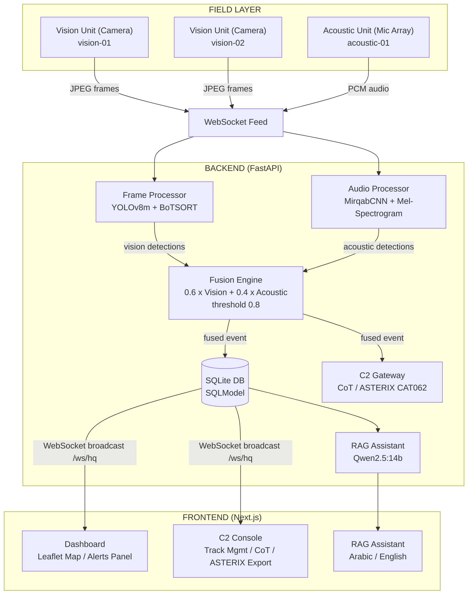
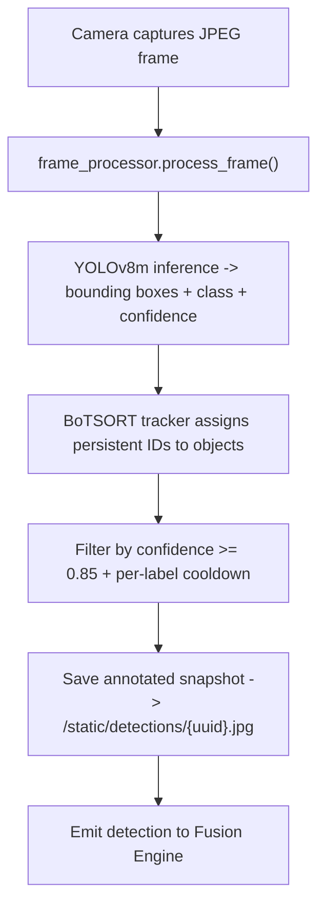
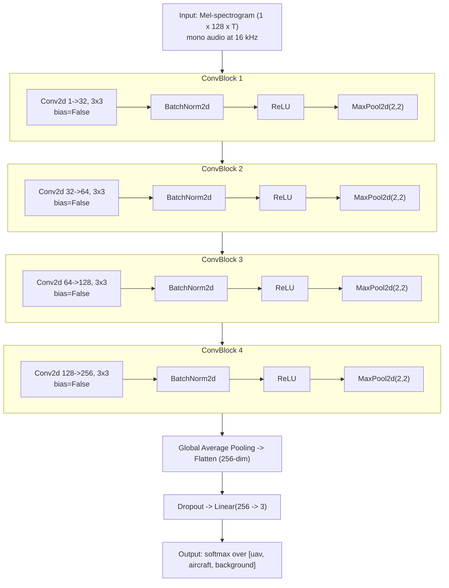
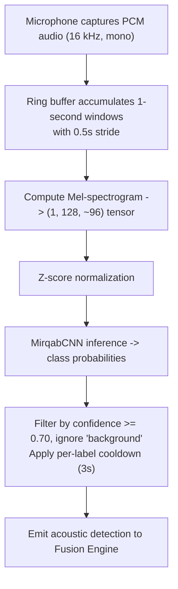
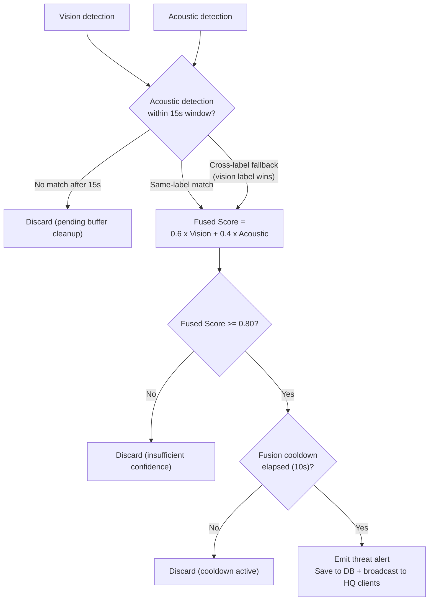
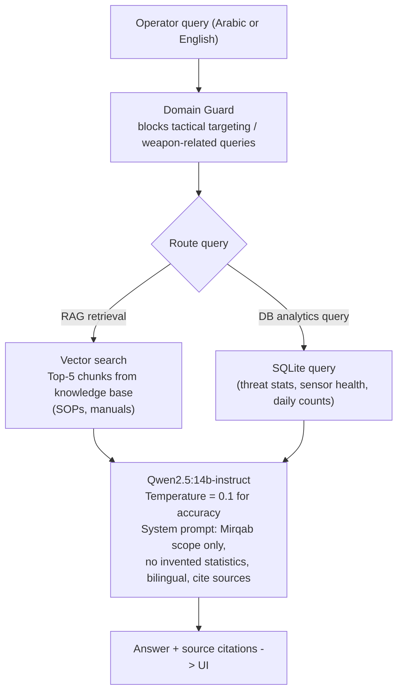

# Mirqab: Real-Time Aerial Threat Detection & Sensor Fusion System

<div align="center">

[](#-award)


</div>

> **مرقاب** (Mirqab) - Arabic for *Observer* or *Sentinel*

Mirqab is an end-to-end situational awareness platform for early-warning airspace monitoring. It fuses multi-modal sensor data (computer vision and acoustic classification) from distributed field units into a unified threat picture delivered to a real-time command dashboard. The system is designed for low-altitude aerial threat detection (UAVs, aircraft) with support for NATO-standard C2 handoff protocols.

---

## 🏆 Award

**1st Place - Defensethon**

Mirqab took first place at Defensethon, recognized for its real-time multi-modal sensor fusion approach and full-stack execution from field-unit ingestion through to NATO-standard C2 export.

---

## Table of Contents

- [Award](#-award)
- [System Architecture](#system-architecture)
- [Key Features](#key-features)
- [AI & ML Models](#ai--ml-models)
  - [Vision Model: YOLOv8m (Fine-tuned)](#vision-model-yolov8m-fine-tuned)
  - [Audio Model: MirqabCNN (Custom)](#audio-model-mirqabcnn-custom)
  - [Sensor Fusion Engine](#sensor-fusion-engine)
  - [RAG Assistant: Qwen2.5 + Qwen3 Embeddings](#rag-assistant-qwen25--qwen3-embeddings)
- [Tech Stack](#tech-stack)
- [Project Structure](#project-structure)
- [Getting Started](#getting-started)
  - [Prerequisites](#prerequisites)
  - [Backend Setup](#backend-setup)
  - [Frontend Setup](#frontend-setup)
  - [Docker (Recommended)](#docker-recommended)
- [Environment Variables](#environment-variables)
- [API Overview](#api-overview)
- [WebSocket Protocol](#websocket-protocol)
- [C2 Integration (CoT & ASTERIX)](#c2-integration-cot--asterix)
- [Database Schema](#database-schema)
- [Training Pipelines](#training-pipelines)
- [Screenshots & UI](#screenshots--ui)
- [Roadmap](#roadmap)
- [License](#license)

---

## System Architecture



---

## Key Features

| Feature | Description |
|---------|-------------|
| **Real-time Vision Detection** | YOLOv8m running inference on live JPEG streams from field cameras |
| **Acoustic Classification** | Custom CNN classifying UAV and aircraft audio signatures from microphone input |
| **Sensor Fusion** | Weighted scoring (60% vision + 40% acoustic) validates detections before alerting |
| **Multi-Unit Architecture** | Multiple vision and acoustic nodes per deployment site |
| **Live Threat Map** | Interactive Leaflet map with sensor positions and threat markers |
| **Tactical C2 Dashboard** | Track lifecycle management with handoff-to-radar workflow |
| **CoT / ASTERIX Export** | TAK-compatible Cursor-on-Target XML and NATO ASTERIX CAT062 JSON |
| **RAG Operator Assistant** | AI assistant (Arabic + English) that answers questions about the threat picture |
| **Detection History** | Paginated event log with filtering and CSV export |
| **Simulator Mode** | Synthetic event injection for testing and demos without hardware |
| **Docker Deployment** | One-command full-stack deployment |

---

## AI & ML Models

### Vision Model: YOLOv8m (Fine-tuned)

Mirqab uses a fine-tuned **YOLOv8m** (You Only Look Once, version 8, medium variant) as its primary object detection engine. The model was trained on a curated aerial-threat dataset containing imagery of civilian aircraft, military aircraft, UAVs/drones, and birds.

**Model Details:**

| Property | Value |
|----------|-------|
| Base architecture | YOLOv8m (Ultralytics) |
| Task | Object detection |
| Input | JPEG frames (any resolution, resized internally) |
| Output classes | `uav_threat`, `aircraft`, `bird` |
| Confidence threshold | 0.85 (configurable) |
| Detection cooldown | 2 seconds per label (prevents flooding) |
| Tracker | BoTSORT (multi-object tracking via SciPy) |
| Inference library | `ultralytics` |
| Model weights | `model/model_workspace/models/best_model.pt` |

**Severity Mapping:**

| Detected Class | Severity |
|---------------|----------|
| `uav_threat` | **High** |
| `aircraft` | **Medium** |
| `bird` | **Low** |

**Training Dataset Pipeline:**

The dataset curation pipeline (in `model/model_workspace/`) handles:
- Aggregating 54,000+ images from open-source UAV, military, and civilian aircraft datasets
- Label normalization across different annotation formats
- Perceptual hash-based duplicate detection
- Quality checks (minimum resolution, label density)
- YOLO format export with train/val/test splits

The pipeline produces a clean dataset targeting four base classes: `civilian_aircraft`, `military_aircraft`, `uav`, and `background`, which are then mapped to the three operational output classes.

**How it works in the pipeline:**



---

### Audio Model: MirqabCNN (Custom)

The **MirqabCNN** is a purpose-built convolutional neural network designed to classify aerial sound signatures from microphone input. It was trained on Mel-spectrogram representations of UAV propeller noise and aircraft engine sounds.

**Model Architecture:**



**Audio Processing Details:**

| Property | Value |
|----------|-------|
| Sample rate | 16,000 Hz (auto-resampled) |
| Window size | 1.0 second |
| Stride | 0.5 seconds (50% overlap) |
| FFT size | 1024 |
| Hop length | 512 |
| Mel bands | 128 |
| Normalization | Z-score per spectrogram (mean=0, std=1) |
| Output classes | `uav`, `aircraft`, `background` |
| Confidence threshold | 0.70 (configurable) |
| Detection cooldown | 3 seconds per label |
| Model weights | `model/audio_workspace/models/best_model.pth` |
| Framework | PyTorch + torchaudio |

**How it works in the pipeline:**



**Training Pipeline:**

The audio training pipeline (in `model/audio_workspace/`) uses:
- **Librosa** for feature extraction and augmentation
- **torchaudio** for real-time spectrogram computation
- **scikit-learn** for train/val stratified splitting
- Augmentation: time-stretching, pitch shifting, additive Gaussian noise
- Training framework: **PyTorch** with AdamW optimizer and cosine LR schedule

---

### Sensor Fusion Engine

The fusion engine (`back-end/app/fusion.py`) is the core decision-making component. Its purpose is to **reduce false positives** by requiring corroboration from two independent sensor modalities before issuing a threat alert.

**Fusion Formula:**

```
Fused Score = (0.6 x Vision Confidence) + (0.4 x Acoustic Confidence)
```

**Decision Flow:**



**Decision Rules:**

| Fused Score | Action |
|-------------|--------|
| ≥ 0.80 | Emit threat alert + save to DB + broadcast to all HQ clients |
| < 0.80 | Discard (insufficient confidence) |

**Pairing Strategy:**

The engine matches vision and acoustic detections within a **15-second temporal window**:

1. **Same-label match** (preferred): vision `uav` + acoustic `uav` → fused `uav`
2. **Cross-label fallback**: vision `aircraft` + acoustic `uav` → fused `aircraft` (vision label wins)

**Label Normalization:**

| Source | Raw Label | Fused Label |
|--------|-----------|-------------|
| Vision | `uav_threat` | `uav` |
| Vision | `aircraft` | `aircraft` |
| Vision | `bird` | *(dropped - not threat-relevant)* |
| Acoustic | `uav` | `uav` |
| Acoustic | `aircraft` | `aircraft` |
| Acoustic | `background` | *(dropped)* |

**Additional Controls:**
- **Fusion cooldown**: 10 seconds between same-label alerts per unit (prevents alert flooding on sustained threats)
- **Spatial matching**: Nearest-unit policy via Haversine distance when multiple field units are deployed
- **Pending buffer cleanup**: Unmatched detections are discarded after 15 seconds

---

### RAG Assistant: Qwen2.5 + Qwen3 Embeddings

Mirqab includes an AI-powered operator assistant that answers questions about the current threat picture, sensor health, incident history, and operational procedures. It runs **entirely locally** via Ollama, with no cloud API calls.

**Models:**

| Component | Model | Purpose |
|-----------|-------|---------|
| LLM | `qwen2.5:14b-instruct` | Response generation (Arabic + English) |
| Embeddings | `dengcao/Qwen3-Embedding-0.6B:Q8_0` | Semantic document search |

**Architecture:**



**Domain Restrictions (System Prompt):**

The assistant is constrained to:
- Mirqab alert summaries and threat statistics
- Sensor node status and health
- Dashboard analytics and incident reports
- Operational troubleshooting

The assistant explicitly **refuses** to:
- Provide tactical targeting advice
- Give fire control guidance
- Assist with weapon deployment instructions

---

## Tech Stack

**Backend:**

| Component | Technology |
|-----------|-----------|
| Framework | FastAPI 0.115+ |
| ASGI Server | Uvicorn (with websockets) |
| ORM | SQLModel (SQLAlchemy + Pydantic) |
| Database | SQLite (production: configurable) |
| Vision inference | Ultralytics YOLOv8 |
| Video capture | OpenCV (headless) |
| Audio inference | PyTorch 2.1+ + torchaudio |
| Audio capture | sounddevice |
| Multi-object tracking | BoTSORT (SciPy-based) |
| Local LLM | Ollama (qwen2.5:14b-instruct) |
| HTTP client | httpx (async) |

**Frontend:**

| Component | Technology |
|-----------|-----------|
| Framework | Next.js 16.2 (App Router) |
| Language | TypeScript |
| Styling | Tailwind CSS 4 |
| UI Primitives | Radix UI (50+ components) |
| Mapping | Leaflet + React-Leaflet |
| State management | Zustand |
| Animations | Framer Motion |
| Charts | Recharts |
| Notifications | Sonner |

**Infrastructure:**

| Component | Technology |
|-----------|-----------|
| Containerization | Docker + Docker Compose |
| Deployment | Coolify (self-hosted PaaS) |
| Persistent storage | Named Docker volumes |

---

## Project Structure

```
Mirqab/
├── back-end/
│   ├── app/
│   │   ├── main.py                # FastAPI app entry point
│   │   ├── database.py            # SQLModel setup + seed units
│   │   ├── models.py              # Data models (TacticalTrack, DetectionEvent, Unit)
│   │   ├── helpers.py             # Serialization utilities
│   │   ├── frame_processor.py     # YOLOv8m inference + BoTSORT tracking
│   │   ├── audio_processor.py     # MirqabCNN inference + Mel-spectrogram
│   │   ├── camera_detector.py     # Live camera capture service
│   │   ├── audio_detector.py      # Live microphone capture service
│   │   ├── fusion.py              # Multi-modal sensor fusion engine
│   │   ├── feed_manager.py        # WebSocket JPEG relay (field → HQ)
│   │   ├── c2_gateway.py          # Tactical track lifecycle + CoT/ASTERIX export
│   │   ├── simulator.py           # Synthetic event generator (demo mode)
│   │   ├── websocket.py           # HQ broadcast manager
│   │   ├── routers/
│   │   │   ├── detections.py      # POST /api/detections
│   │   │   ├── units.py           # GET/POST /api/units
│   │   │   ├── events.py          # GET /api/events
│   │   │   ├── c2.py              # C2 tracks, handoff, CoT, ASTERIX
│   │   │   ├── simulator.py       # Start/stop simulator
│   │   │   ├── camera.py          # Camera control
│   │   │   ├── audio.py           # Audio upload + inference
│   │   │   ├── rag.py             # RAG query endpoint
│   │   │   └── ...
│   │   └── rag/
│   │       ├── config.py          # Ollama + model configuration
│   │       ├── llm.py             # Generation with domain guard
│   │       ├── embedder.py        # Batch embedding via Ollama
│   │       ├── retriever.py       # Semantic search
│   │       ├── vector_store.py    # In-memory vector index
│   │       ├── chunker.py         # Document chunking
│   │       ├── ingester.py        # Knowledge base loader
│   │       ├── db_analytics.py    # Structured DB query handler
│   │       └── domain_guard.py    # Out-of-scope query filter
│   ├── model/
│   │   ├── model_workspace/
│   │   │   └── models/best_model.pt       # YOLOv8m weights
│   │   └── audio_workspace/
│   │       └── models/best_model.pth      # MirqabCNN weights
│   ├── requirements.txt
│   ├── Dockerfile
│   └── .env.example
├── front-end/
│   ├── app/
│   │   ├── page.tsx               # Main dashboard
│   │   ├── c2/page.tsx            # C2 tactical console
│   │   ├── assistant/page.tsx     # RAG assistant chat
│   │   ├── history/page.tsx       # Detection history
│   │   └── layout.tsx
│   ├── components/
│   │   ├── threat-map.tsx         # Leaflet map + live camera feed
│   │   ├── alerts-panel.tsx       # Real-time alert cards
│   │   ├── stats-cards.tsx        # KPI counters
│   │   ├── sidebar.tsx            # Navigation + controls
│   │   └── ...
│   ├── hooks/
│   │   ├── use-backend-events.ts  # WebSocket ingestion + state mapping
│   │   └── use-simulation.ts      # Simulator API wrapper
│   ├── lib/
│   │   ├── store.ts               # Zustand global state
│   │   ├── api.ts                 # REST API wrappers
│   │   └── mock-data.ts           # Dev sample data
│   ├── package.json
│   └── next.config.mjs
└── docker-compose.yml
```

---

## Getting Started

### Prerequisites

- Python 3.12+
- Node.js 20+
- [Ollama](https://ollama.com/) (for the RAG assistant)
- CUDA-capable GPU (recommended for real-time YOLO inference) or CPU fallback
- Docker & Docker Compose (for containerized deployment)

### Backend Setup

```bash
cd back-end

# Create and activate virtual environment
python -m venv venv
source venv/bin/activate      # Linux/macOS
.\venv\Scripts\Activate.ps1   # Windows PowerShell

# Install dependencies
pip install -r requirements.txt

# Copy and configure environment
cp .env.example .env
# Edit .env with your settings (see Environment Variables section)

# Run the development server
uvicorn app.main:app --reload --host 0.0.0.0 --port 8000
```

The backend will be available at `http://localhost:8000`.  
Interactive API docs: `http://localhost:8000/docs`

### Frontend Setup

```bash
cd front-end

# Install dependencies
npm install

# Create environment file
echo "NEXT_PUBLIC_BACKEND_URL=http://localhost:8000" > .env.local
echo "NEXT_PUBLIC_WS_URL=ws://localhost:8000/ws/hq" >> .env.local

# Run the development server
npm run dev
```

The dashboard will be available at `http://localhost:3000`.

### RAG Assistant Setup

```bash
# Install Ollama from https://ollama.com
ollama pull qwen2.5:14b-instruct
ollama pull dengcao/Qwen3-Embedding-0.6B:Q8_0
```

Place any operator manuals, SOPs, or knowledge-base documents in `back-end/app/rag/rag-documents/` (PDF, Markdown, or TXT). They will be automatically indexed on backend startup.

### Docker (Recommended)

```bash
# Build and start all services
docker compose up --build

# Run in background
docker compose up --build -d

# Stop all services
docker compose down
```

Services:
- **Backend**: `http://localhost:8000`
- **Frontend**: `http://localhost:3000`

> **Note:** The RAG assistant requires Ollama running on the host. Set `OLLAMA_BASE_URL=http://host.docker.internal:11434` in the backend environment when using Docker on Mac/Windows.

---

## Environment Variables

### Backend (`.env`)

| Variable | Default | Description |
|----------|---------|-------------|
| `DATABASE_URL` | `sqlite:///./mirqab.db` | SQLAlchemy connection string |
| `CORS_ORIGINS` | `http://localhost:3000,...` | Allowed CORS origins (comma-separated) |
| `SIMULATOR_AUTOSTART` | `false` | Auto-start synthetic event generator on boot |
| `CAMERA_AUTOSTART` | `false` | Auto-start local camera capture on boot |
| `AUDIO_AUTOSTART` | `false` | Auto-start local microphone capture on boot |
| `CAMERA_INDEX` | `0` | OpenCV camera device index |
| `CAMERA_FPS` | `10` | Target frames per second for camera capture |
| `MODEL_PATH` | `model/model_workspace/models/best_model.pt` | YOLOv8m weights path |
| `DETECTION_CONFIDENCE` | `0.85` | Minimum YOLO confidence threshold |
| `DETECTION_COOLDOWN` | `2.0` | Seconds between repeated detections of same label |
| `AUDIO_MODEL_PATH` | `model/audio_workspace/models/best_model.pth` | MirqabCNN weights path |
| `AUDIO_CONFIDENCE` | `0.70` | Minimum audio classification confidence |
| `AUDIO_COOLDOWN` | `3.0` | Seconds between repeated audio detections of same label |
| `FUSION_THRESHOLD` | `0.80` | Minimum fused score to issue an alert |
| `FUSION_WINDOW` | `15.0` | Temporal window (s) for pairing vision+acoustic |
| `FUSION_COOLDOWN` | `10.0` | Cooldown (s) between same-label fused alerts per unit |
| `OLLAMA_BASE_URL` | `http://localhost:11434` | Ollama API endpoint |
| `RAG_LLM_MODEL` | `qwen2.5:14b-instruct` | LLM model name in Ollama |
| `RAG_EMBEDDING_MODEL` | `dengcao/Qwen3-Embedding-0.6B:Q8_0` | Embedding model name in Ollama |
| `RAG_TOP_K` | `5` | Number of document chunks to retrieve per query |
| `RAG_TEMPERATURE` | `0.1` | LLM sampling temperature (lower = more deterministic) |

### Frontend (`.env.local`)

| Variable | Default | Description |
|----------|---------|-------------|
| `NEXT_PUBLIC_BACKEND_URL` | `http://localhost:8000` | Backend REST API base URL |
| `NEXT_PUBLIC_WS_URL` | `ws://localhost:8000/ws/hq` | HQ WebSocket URL |

---

## API Overview

### REST Endpoints

| Method | Path | Description |
|--------|------|-------------|
| `GET` | `/api/units` | List all sensor units with status |
| `POST` | `/api/units` | Register a new sensor unit |
| `GET` | `/api/events` | List recent detection events (paginated) |
| `POST` | `/api/detections` | Submit a detection event |
| `GET` | `/api/c2/tracks` | List all active tactical tracks |
| `POST` | `/api/c2/tracks/{id}/handoff` | Handoff track to radar/external C2 |
| `GET` | `/api/c2/tracks/{id}/cot` | Export track as CoT XML |
| `GET` | `/api/c2/tracks/{id}/asterix` | Export track as ASTERIX CAT062 JSON |
| `POST` | `/api/simulator/start` | Start synthetic event generator |
| `POST` | `/api/simulator/stop` | Stop synthetic event generator |
| `GET` | `/api/simulator/status` | Simulator running state |
| `POST` | `/api/rag/query` | Submit a question to the RAG assistant |
| `GET` | `/api/rag/status` | Check Ollama connectivity |

Full interactive documentation is available at `http://localhost:8000/docs` (Swagger UI) and `http://localhost:8000/redoc`.

---

## WebSocket Protocol

### `/ws/hq` - HQ Broadcast

All connected dashboard clients receive threat events and unit status changes in real-time.

**Incoming message types:**

```json
{
  "type": "detection",
  "unit_id": "vision-01",
  "unit_type": "vision",
  "label": "uav_threat",
  "confidence": 0.94,
  "severity": "high",
  "lat": 24.6877,
  "lng": 46.7219,
  "timestamp": "2025-10-15T09:32:17Z",
  "source": "fusion",
  "frame_url": "/static/detections/abc123.jpg",
  "track_id": "TRK-00042"
}
```

```json
{
  "type": "unit_status",
  "unit_id": "acoustic-01",
  "status": "online",
  "last_seen": "2025-10-15T09:32:10Z"
}
```

### `/ws/unit/{unit_id}/feed` - Field Unit Video Feed (inbound)

Field cameras send JPEG frames as binary WebSocket messages to this endpoint. The backend decodes, runs YOLO inference, and relays to viewers.

### `/ws/unit/{unit_id}/view` - HQ Video Viewer (outbound)

HQ clients subscribe to receive annotated JPEG frames from a specific field unit. Frames are forwarded as binary messages at the camera's capture rate.

---

## C2 Integration (CoT & ASTERIX)

Mirqab supports exporting confirmed tracks to external C2 systems via two standard formats.

### Cursor-on-Target (CoT) XML

TAK-compatible format for SA tools (ATAK, WinTAK, iTAK):

```xml
<?xml version="1.0" encoding="UTF-8"?>
<event uid="TRK-00042" type="a-h-A-M-F-U" time="2025-10-15T09:32:17Z"
       start="2025-10-15T09:30:00Z" stale="2025-10-15T09:47:17Z" how="m-r">
  <point lat="24.6877" lon="46.7219" hae="250.0" ce="50.0" le="30.0"/>
  <detail>
    <track speed="18.5" course="215.0"/>
    <remarks>UAV threat | Fused confidence: 0.91 | Vision: 0.94 | Acoustic: 0.87</remarks>
  </detail>
</event>
```

### ASTERIX CAT062 JSON

NATO standard format for radar/sensor data fusion systems:

```json
{
  "category": 62,
  "trackNumber": "TRK-00042",
  "positionWGS84": { "latitude": 24.6877, "longitude": 46.7219, "altitude_m": 250.0 },
  "groundSpeed": 18.5,
  "trackAngle": 215.0,
  "verticalRate": -1.2,
  "confidence": 0.91,
  "threatLevel": "high",
  "objectType": "UAV",
  "status": "confirmed",
  "timestamp": "2025-10-15T09:32:17Z"
}
```

---

## Database Schema

```sql
-- Sensor nodes (cameras, microphones)
CREATE TABLE units (
    unit_id     TEXT PRIMARY KEY,
    unit_type   TEXT,             -- "vision" | "acoustic"
    name        TEXT,
    status      TEXT,             -- "online" | "offline"
    lat         FLOAT,
    lng         FLOAT,
    last_seen   TIMESTAMP,
    metadata_json TEXT
);

-- Raw detection events from field units and fusion engine
CREATE TABLE detection_events (
    id            TEXT PRIMARY KEY,
    unit_id       TEXT,
    unit_type     TEXT,
    event_type    TEXT,           -- "detection"
    label         TEXT,           -- "uav" | "aircraft" | "uav_threat" | ...
    confidence    FLOAT,
    severity      TEXT,           -- "low" | "medium" | "high"
    lat           FLOAT,
    lng           FLOAT,
    timestamp     TIMESTAMP,
    source        TEXT,           -- "model" | "fusion" | "simulator" | "unit_web_demo"
    frame_id      TEXT,
    frame_url     TEXT,           -- /static/detections/{uuid}.jpg
    bbox_json     TEXT,           -- {"x1", "y1", "x2", "y2"}
    metadata_json TEXT
);

-- Tactical tracks managed by the C2 gateway
CREATE TABLE tactical_tracks (
    track_id              TEXT PRIMARY KEY,
    object_type           TEXT,   -- "UAV" | "AIRCRAFT" | "UNKNOWN"
    threat_level          TEXT,   -- "low" | "medium" | "high" | "critical"
    status                TEXT,   -- "new" | "tracking" | "confirmed" | "lost"
    recommended_action    TEXT,
    lat                   FLOAT,
    lon                   FLOAT,
    alt_m                 FLOAT,
    speed_mps             FLOAT,
    heading_deg           FLOAT,
    vertical_rate_mps     FLOAT,
    confidence_vision     FLOAT,
    confidence_acoustic   FLOAT,
    confidence_fused      FLOAT,
    horizontal_error_m    FLOAT,
    vertical_error_m      FLOAT,
    node_id               TEXT,
    source_unit_type      TEXT,
    sensor_ids_json       TEXT,   -- JSON array of contributing sensor IDs
    created_at            TIMESTAMP,
    updated_at            TIMESTAMP,
    last_seen_at          TIMESTAMP,
    detection_event_id    TEXT,
    frame_url             TEXT
);
```

---

## Training Pipelines

### Vision Training (`model/model_workspace/`)

The dataset curation pipeline prepares training data for YOLOv8:

```bash
# Run data curation
cd model/model_workspace
pip install -r requirements.txt

# Curate and export dataset
python curate_dataset.py   # normalize + deduplicate + quality check
python export_yolo.py      # export to YOLO format with splits

# Train (requires GPU)
yolo train model=yolov8m.pt data=dataset.yaml epochs=100 imgsz=640
```

### Audio Training (`model/audio_workspace/`)

The audio pipeline trains MirqabCNN on Mel-spectrograms:

```bash
cd model/audio_workspace
pip install -r requirements.txt

# Extract features from raw audio files
python extract_features.py --input raw_audio/ --output spectrograms/

# Train MirqabCNN
python train.py --data spectrograms/ --epochs 50 --lr 1e-3

# Evaluate
python evaluate.py --model models/best_model.pth --test spectrograms/test/
```

**Audio training dependencies:**
```
numpy, scipy, librosa, soundfile, pandas, pyarrow, tqdm,
pyyaml, scikit-learn, torch, torchaudio, matplotlib, seaborn
```

---

## Screenshots & UI

### Main Dashboard

The primary operator view provides a real-time threat map, live alert feed, and sensor status panel. Threats are color-coded by type (UAV = emerald, aircraft = blue) and severity. Operators can click any threat marker to view the detection snapshot from the field camera.

### C2 Tactical Console

The C2 screen lists all active tactical tracks with kinematic state (position, speed, heading, altitude). Each track shows vision/acoustic/fused confidence scores and can be exported to CoT XML or ASTERIX CAT062 JSON, or marked for handoff to radar.

### RAG Operator Assistant

A conversational interface supporting Arabic and English. Operators can ask natural-language questions about the threat picture ("What were the highest-confidence detections today?", "Which sensor nodes are offline?"). The assistant cites its sources and refuses out-of-scope tactical queries.

### Simulator Mode

Toggle the simulator from the sidebar to inject synthetic detections without physical sensors, ideal for operator training, UI testing, and demonstrations.

---

## Roadmap

- [ ] API key authentication and role-based access control
- [ ] PostgreSQL backend for multi-instance production deployments
- [ ] Radar data integration (ADS-B feed import)
- [ ] Mobile-optimized responsive layout
- [ ] Threat trajectory prediction (Kalman filter extrapolation)
- [ ] Alert escalation workflow with acknowledgment tracking
- [ ] Multi-site federation (multiple HQ nodes)
- [ ] Exportable PDF incident reports
- [ ] HTTPS/WSS support for secure field deployments

---

## License

This project is developed as a specialized tactical awareness system. All model weights, training data pipelines, and system architecture are proprietary. Contact the project maintainer for licensing inquiries.

---

*Built by the Mirqab Team - 🏆 1st Place, Defensethon*
